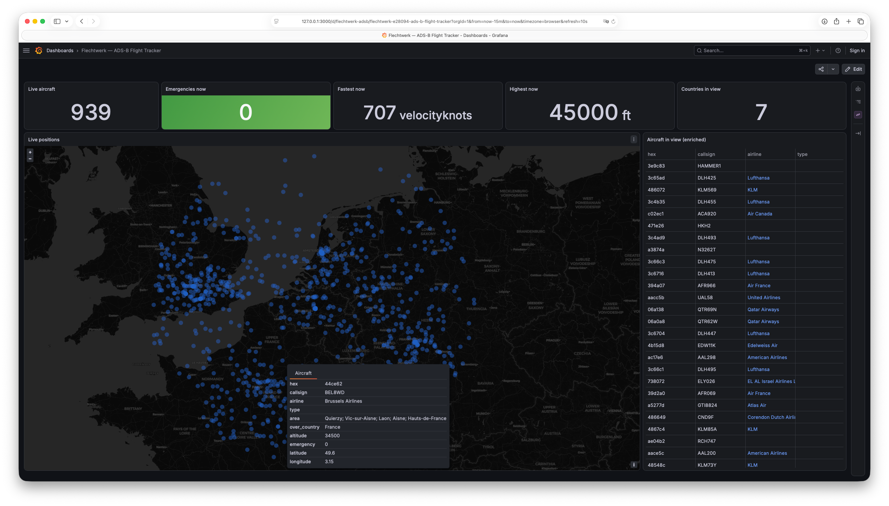
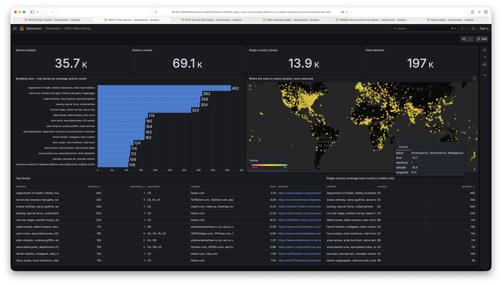

# Flechtwerk Examples

<div align="center">
  
  <a href="https://bsure-analytics.github.io/flechtwerk/"></a>
  <a href="https://github.com/bsure-analytics/flechtwerk-examples/actions/workflows/ci.yaml"></a>
  <a href="https://pypi.org/project/flechtwerk/0.7.1/"></a>
  
  <a href="https://opensource.org/licenses/MIT"></a>
  
</div>

<p align="center"><strong>Easy + Reliable + Scalable =&gt; Productive</strong></p>

Complete, runnable examples for [Flechtwerk](https://github.com/bsure-analytics/flechtwerk) —
an async stream-processing framework for Kafka with real transactions for
exactly-once delivery and an MQTT→Kafka bridge.

This repo **complements** the minimal snippets in the framework's own docs. The
main repo keeps quickstart snippets, CI-tested via testcontainers; this repo
carries full scenarios with real infrastructure, pinned to a released PyPI
version and upgraded deliberately. It doubles as an integration test of the
published package, exercised exactly the way a consumer would use it.

<p align="center">
  <a href="examples/adsb_flight_tracker"></a>
  &nbsp;
  <a href="examples/gdelt_news_stories"></a>
</p>
<p align="center"><em>Two of the examples, live in Grafana — <a href="examples/adsb_flight_tracker">ADS-B Flight Tracker</a> and <a href="examples/gdelt_news_stories">GDELT News Stories</a>.</em></p>

## What's Inside

A single batteries-included stack (`docker compose up`) plus one package per
scenario under `examples/`:

| # | Example | Shows off | Run |
|---|---------|-----------|-----|
| 1 | [`adsb_flight_tracker`](examples/adsb_flight_tracker) | a 3-stage `Extractor`→`Transformer`→`Transformer` pipeline (+ a config-driven boundary-loader stage): raw capture, spread-through projection, state-as-enrichment-cache (live Wikidata labels + a ClickHouse polygon-dictionary reverse geocoder), derived events, baby-TCAS conflict detection | `adsb` |
| 2 | [`clickhouse_sink`](examples/clickhouse_sink) | a sink transformer with honest at-least-once side-effect semantics (idempotent writes) | `setup-sink` → `adsb` + `run-sink` |
| 3 | [`chaos_harness`](examples/chaos_harness) | an executable exactly-once proof — SIGKILL a stage mid-batch, assert zero dupes/gaps | `chaos` |
| 4 | [`fermentation_monitor`](examples/fermentation_monitor) | the `MqttExtractor` bridge (ACK only after Kafka) + a stateful gravity monitor | `fermentation` |
| 5 | [`gdelt_news_stories`](examples/gdelt_news_stories) | batch-file firehose ingestion (a resume-cursor `Extractor` over the GDELT 15-min feed), a co-partitioned Events⋈Mentions join with out-of-order buffering, online clustering of articles into stories in keyed state, and config-topic (GlobalKTable-style) outlet enrichment | `gdelt` |

Each example is self-contained under its own directory with its own README.

## Requirements

- **Python 3.14** and [`uv`](https://docs.astral.sh/uv/) — pinned via
  `requires-python` in `pyproject.toml`.
- **Docker** — for the shared stack and the integration test tier.

## Quickstart

```bash
uv sync                 # create the venv and install the pinned dependencies
uv run poe up           # start the shared stack, wait until healthy
uv run poe adsb         # set up + run the ADS-B flight tracker (stays in the foreground)
uv run poe request-region "Brussels" 250   # (second terminal) track a region; radius in nautical miles
uv run poe down         # stop the stack, preserving its volumes (resume later)
uv run poe clean        # stop the stack AND wipe its volumes (a full reset)
```

The tasks above are [poethepoet](https://github.com/nat-n/poethepoet) targets
declared in `pyproject.toml`; run `uv run poe` with no argument to list them all.

## The Stack

`docker compose up` (or `uv run poe up`) brings up six long-running services
(plus a one-shot `kafka-init` that chowns the Kafka volume and exits):

| Service | URL / port | What it's for |
|---|---|---|
| Kafka | `localhost:9092` | the broker (KRaft, single node); examples connect here |
| Kafbat UI (web UI for Kafka) | <http://localhost:8080> | browse topics, messages, consumer groups |
| Mosquitto | `localhost:1883` | MQTT broker for the bridge examples |
| ClickHouse | <http://localhost:8123> (HTTP), `localhost:9000` (native) | OLAP sink for every example's output (database `flechtwerk`) |
| Prometheus | <http://localhost:9090> | scrapes each running stage's metrics endpoint |
| Grafana | <http://localhost:3000> | provisioned dashboards (anonymous access) |

Grafana provisions dashboards tagged `flechtwerk`: **Framework Metrics** (the
`flechtwerk_*` Prometheus metrics — messages in/out, transactions committed,
batch sizes, state restores, config-store and ownership gauges), **Stream Data**
(a ClickHouse datasource smoke test), and per-example dashboards — **ADS-B Flight
Tracker** (a live map + enriched table), **ADS-B Live Aviation Events**
(emergencies, rapid descents, going-dark, near-misses), **Fermentation
Monitor** (gravity curves + alerts), and **GDELT News Stories** (breaking-news
velocity, top stories, a tone-coloured world map, coverage spread).

Stages run on the host and expose Prometheus metrics on a per-example port
(`9101` ADS-B ingest + `9105` ADS-B enrich + `9106` ADS-B conflict + `9107` ADS-B
boundary loader, `9102` sink, `9103` fermentation monitor + `9104` fermentation
bridge, `9108` GDELT ingest + `9109` GDELT coverage + `9110` GDELT stories + `9111`
GDELT sink; the chaos harness runs metrics-off);
Prometheus reaches them via `host.docker.internal`, so a target reads "down"
until you start its example.

## Testing

Every example ships tests in three tiers, mirroring the framework's own suite:

1. **Pure-logic tier** — no framework, no mocks. A stage is a plain async
   generator: build a `State`, drive the generator, assert on the yielded
   `Message`/`State`. This is the two-yield contract's biggest practical payoff.
2. **Runner tier** — the shipped `flechtwerk.testing` fakes (`InMemoryStateStore`,
   `FakeKafkaConsumer`/`FakeKafkaProducer`, `FakeMqttConnection`, `make_record`,
   `RecordingObserver`), never parallel scaffolding.
3. **Integration tier** — ephemeral Kafka/Mosquitto/ClickHouse via
   testcontainers, marked `integration` and run with `-m integration`.

```bash
uv run poe test               # tiers 1 + 2 — Docker-free
uv run poe test-integration   # tier 3 — needs Docker
uv run poe test-all           # everything (what CI runs)
uv run poe cov                # everything, with a coverage report
```

The Docker-free tiers require no services running. The integration tier starts
its own containers and skips cleanly when Docker is unreachable.

## Issues and Contributions

This repo is the home for Flechtwerk's runnable examples (they deliberately live
here, not in the framework repo). Found a bug, or have a scenario you'd like to
see? Open an issue or PR here. For the framework itself, use the
[flechtwerk](https://github.com/bsure-analytics/flechtwerk) issue tracker.

## Versioning Policy

`flechtwerk` is pinned to an exact released version in `pyproject.toml`
(`flechtwerk[mqtt]==0.7.1`) with the full resolution captured in `uv.lock` —
never a path or git dependency; the Docker images are pinned to specific tags
too. Upgrades are deliberate: bump the pins, relock, and let the tests and a live
end-to-end pass verify the new release.

## License

[MIT](LICENSE), the same as the framework.
