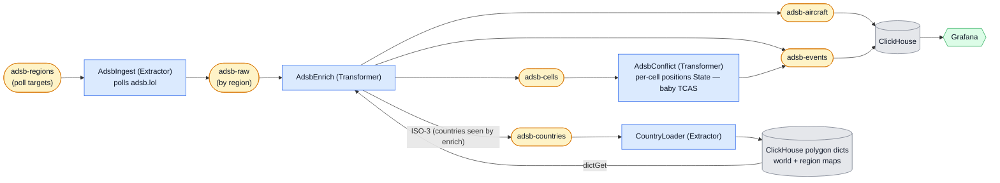

# ADS-B Flight Tracker

A three-stage **Extractor → Transformer → Transformer** data pipeline over the free
[adsb.lol](https://adsb.lol) API, plus a companion **boundary loader** that
provisions the reverse-geocoding "map". It doesn't just plot dots on a map (adsb.lol
does that better) — it **derives** what a raw feed can't: live-enriched aircraft,
an aviation-events stream (emergencies, rapid descents, going-dark), and near-miss
conflict detection. No hardware, no API key.

<p align="center">
  
</p>
<p align="center"><em>Live in Grafana: enriched aircraft on the map, derived aviation events, and at-a-glance stats.</em></p>



Reverse geocoding is **staged and traffic-driven**: `CountryLoader` loads a global country
map (ADM0) at startup; `AdsbEnrich` looks up each aircraft's country in it and writes that
country's ISO-3 to `adsb-countries`; `CountryLoader` consumes those and downloads *all* of
that country's admin levels (ADM1…ADM5, whichever it publishes) on demand — one polygon
dictionary per level — which `AdsbEnrich` stacks into a hierarchical label
(`Le Bourget; Marne; Grand Est`). So an aircraft over *any* country gets a label, as fine
as that country's data goes — not just the polled one.

## What it demonstrates

- **Split ingestion from transformation — and keep the raw feed.** `AdsbIngest`
  writes each poll to `adsb-raw` as three **nested Records** — the whole response
  untouched, the `config` that produced it, and `metadata` provenance
  (`fetched_at` + a `fetch_duration` timedelta). Nesting keeps the uncontrolled
  feed schema in its own namespace (no key can collide with ours). The feed is
  live and un-replayable, so capturing raw is the only way to keep history:
  improve the enrichment later and reprocess `adsb-raw` from the changelog instead
  of re-polling a feed that has already moved on.
- **Attributes only for what you compute with — the rest spreads through.** The
  enrich stage declares a typed `Attribute` only for fields it reads to decide or
  writes as derived; every other adsb.lol field (there are dozens — `gs`, `track`,
  `rssi`, `nav_*`, …) rides through untouched by *spreading* the raw record. A new
  upstream field therefore appears in ClickHouse with **no code change** — the sink
  reads each message whole into a `JSON` column (nested feed structure preserved
  natively, no flattening) and promotes only the fields the dashboards use, so an
  un-promoted field is queryable as `payload.<field>` (see "The ClickHouse sink"
  below). The attribute list stays short.
  Feed fields keep their wire names; the dashboards alias them at query time
  (`trimBoth(flight) AS callsign`). (The trick is borrowed from the fret `xovis`
  transformer.) The one polymorphic field, `alt_baro` (a number **or** the string
  `"ground"`), passes through *faithfully* — coerced to feet only where a stage
  computes with it (`altitude_ft`), so a parked aircraft stays distinguishable from
  one at sea level. That fidelity reaches all the way into ClickHouse: the
  `alt_baro` column is a `Dynamic` that keeps `"ground"` verbatim (it means "on the
  surface", **not** 0 ft MSL), and only the one panel that needs feet coerces at
  query time.
- **The state store as a live enrichment cache — the headline.** `AdsbEnrich`
  resolves airline + aircraft-type names (with Wikipedia links) from Wikidata, each
  looked up **once** per entity and cached in the region's `State` (`airline_cache` /
  `type_cache`). Because that state is changelog-backed, the cache **survives a
  restart**: a re-launched enrich stage re-issues *zero* lookups for entities it
  already resolved. Look up once, remember forever, restore from the log. Reverse
  geocoding (admin area + country) is a **local ClickHouse polygon-dictionary** batch
  over each aircraft's exact position, every poll — cheap and more accurate than a
  cached grid cell, so it is deliberately **not** cached (next bullet).
- **A staged, traffic-driven, self-provisioning reverse-geocoding map.** Reverse
  geocoding needs no Nominatim (nor PostGIS). `CountryLoader` downloads a global country
  map (ADM0, [Natural Earth](https://www.naturalearthdata.com) admin-0) into a ClickHouse
  `POLYGON` dictionary at startup; `AdsbEnrich` `dictGet`s it to find each aircraft's
  country and writes that country's ISO-3 to `adsb-countries`; the loader consumes those
  requests and downloads **all** of that country's admin levels
  ([geoBoundaries](https://www.geoboundaries.org) ADM1…ADM5, whichever it publishes) into
  one polygon dictionary per level. enrich then `dictGet`s **every** level for a point and
  concatenates the hits finest→coarsest into a hierarchical label (`Le Bourget; Marne;
  Grand Est`) — a single polygon dict can't do this (it returns only the finest containing
  polygon), so one dict per level. So an aircraft over **any** country gets a label as fine
  as that country's data goes — not just the polled one. It's **just-in-time and
  idempotent**: after `poe up` the dictionaries are empty; only countries with actual
  traffic are fetched, each once (deduped via the table + a changelog timer), re-fetched
  only when stale (world monthly, countries weekly). Tiny data, so "planet scale" needs no
  import or warmup — just the countries you fly over.
  (Aircraft *type* names are attempted the same way but best-effort — Wikidata has
  no ICAO type-designator property, so most don't resolve; the raw designator is
  always shown. A bundled ICAO Doc 8643 table would make it reliable — a follow-up
  if the live-only constraint is relaxed.)
- **Derived events, not a viewer.** From per-aircraft priors kept in `State`, the
  enrich stage emits an `adsb-events` stream: **emergency** squawks (7500/7600/
  7700), **rapid_descent** (a vertical rate the raw per-sample feed never carries),
  and **going_dark** (an airborne aircraft that vanished mid-flight — distinct from
  one that simply landed). Onsets fire once.
- **A stateful spatial self-join (baby TCAS).** `AdsbConflict` flags aircraft that
  get within ~5 nm and ~1000 ft. A self-join needs the compared aircraft on the
  same partition, so the enrich stage re-keys positions by grid cell onto
  `adsb-cells`; the conflict stage keeps each cell's recent positions in `State`
  and checks every arrival against them. Only *airborne* aircraft take part — one on
  the ground or on short final (below an altitude floor) is neither checked nor kept,
  so the ramp full of parked and taxiing aircraft at an airport doesn't read as a
  swarm of false near-misses.
- **Departure tombstones.** When an aircraft drops out of the feed the enrich
  stage emits an event marked `is_deleted=1`; the ClickHouse `ReplacingMergeTree`
  sink treats it as a delete.
- **"Let it crash" — with one documented exception.** A feed timeout or 5xx
  crashes ingest and the orchestrator restarts it (no in-process retry). But
  **enrichment is best-effort**: a Wikidata or ClickHouse hiccup is swallowed, the
  aircraft is emitted un-enriched, and the miss is not cached (it retries next
  poll). Enrichment is a decoration; a flaky lookup must not stall live telemetry —
  the only place the strict policy is deliberately softened.

## Run it

Bring up the [shared stack](../../README.md#the-stack), then `uv run poe adsb` — a
quickstart for `setup-adsb` + `run-adsb`, where `run-adsb` is a poor-man's orchestrator:
it starts all four stages together and **restarts any that crashes** (a 10 s backoff loop
— the local stand-in for what an orchestrator does in prod; state restores from the
changelog on restart). **Ctrl-C** stops them all cleanly (plain children in one process
group; a trap tears down the whole group, no orphans). **Nothing is polled until you
request a region** — there is no hard-coded seed:

```bash
uv run poe adsb                      # quickstart: setup + all four stages (Ctrl-C stops)
uv run poe request-region "London"   # ...then request a region to track (repeat for more)
# ...or step by step:
uv run poe setup-adsb                # create topics + ClickHouse schema (nothing seeded)
uv run poe run-adsb                  # all four stages, restart-on-crash
uv run poe request-region "Berlin" 250   # write a region (+ optional radius, nm) to adsb-regions
# ...or one stage per shell:
uv run poe run-adsb-boundaries # stage 0: world map at startup + per-country maps on demand
uv run poe run-adsb-ingest     # stage 1: ingest adsb.lol -> adsb-raw
uv run poe run-adsb-enrich     # stage 2: unroll + live-enrich -> adsb-aircraft / events / cells
uv run poe run-adsb-conflict   # stage 3: baby-TCAS conflict detection over adsb-cells
```

> This hits the live community **adsb.lol** feed and queries **Wikidata** (labels) and
> **Nominatim** (resolving a requested region's name to its poll centre) — read
> [About the feeds](#about-the-feeds) first. They are best-effort community services
> with no SLA; the poll cadence is a code-enforced 10 s and every lookup is cached, so
> the default run is a good citizen. Reverse geocoding is local (ClickHouse), not a feed.

Then watch it live at <http://localhost:3000>:

- **Grafana → *Flechtwerk — ADS-B Flight Tracker*** — a live map, an enriched
  table (airline / type with Wikipedia links, country, vertical rate), and
  now-stats: emergencies, fastest, highest, countries in view.
- **Grafana → *Flechtwerk — ADS-B Live Aviation Events*** — a scrolling events
  feed, per-type counters, a near-miss list, and per-airline / per-country
  leaderboards. This is the "stop viewing, start deriving" payoff.
- **Grafana → *Flechtwerk — Framework Metrics*** — all four stages roll up under
  `adsb_flight_tracker`: messages out/sec, transactions committed, state restores.
- **Kafbat UI** (<http://localhost:8080>): the `adsb-raw` (whole responses),
  `adsb-aircraft`, `adsb-events`, and `adsb-cells` records as they land.

Poll elsewhere with `uv run poe request-region "<name>" [radius_nm]` (any number of
times), or write to the compacted `adsb-regions` topic with any producer — one record
per region, keyed by name. Give coordinates explicitly (`{"name", "lat", "lon",
"radius"}`), or **drop just a name** and let ingest forward-geocode it — `{"name":
"London"}` resolves to its centre via Nominatim (see `enrich_config` in `ingest.py`),
and `radius` defaults to 100 nm. That geocode runs once, when the config arrives — not
per poll — and, being essential, keeps strict let-it-crash (a name that matches nothing
is a config error). Reverse-geocoding coverage is **independent** of what you request:
the boundary loader maps whichever countries the aircraft are actually over (see above),
so aircraft that stray outside the requested region's country are labelled too.

## The ClickHouse sink is the shortcut — on purpose

This example sinks `adsb-aircraft` and `adsb-events` with ClickHouse's own **Kafka
table engine** (`clickhouse.sql`): a Kafka engine table consumes each topic and a
materialized view lands rows. That is the shortcut [example 2](../clickhouse_sink)
deliberately *avoids* — it builds a Flechtwerk sink stage instead, to make the
at-least-once write semantics explicit. The stack configures the Kafka engine to
read **committed** (`clickhouse/config/kafka.xml`), so aborted pages are never
ingested; what the engine still can't do — enrichment, routing, fan-out, or
unit-testable projection — is exactly what the enrich stage does before the data
reaches here. Exactly-once under real crashes is [example 3](../chaos_harness)'s
subject.

The sink is also **schemaless, Druid-style but typed.** The Kafka engine reads each
message whole into a single `JSON` column (`kafka_format = 'JSONAsObject'`), and the
materialized view promotes only the fields the dashboards read into typed columns,
keeping the whole message in a `payload JSON` catch-all. Any other field the feed
sends is queryable as `payload.<field>` with **no DDL change** — the SQL-side mirror
of "declare an attribute only for what you compute with". Unlike Druid's
degenerate-to-string, ClickHouse's `JSON` type stores each path as its own columnar
sub-column with its own inferred type. (Needs ClickHouse 25.x for the production
`JSON` type; the stack pins 25.8.)

## Tests — the three tiers

```bash
uv run pytest examples/adsb_flight_tracker            # tiers 1 + 2 (Docker-free)
uv run pytest -m integration examples/adsb_flight_tracker  # tier 3 (needs Docker)
```

1. **`tests/logic_test.py` — pure logic.** Drives the three pure functions
   directly — `wrap_response` (ingest), `project_page` (enrich, with a pre-filled
   cache so it stays I/O-free), and `detect_conflicts` (conflict) — asserting the
   enrichment, roster diff, vertical-rate/squawk/going-dark derivation, cell
   fan-out, and near-miss geometry with nothing mocked.
2. **`tests/runner_test.py` — runner tier.** Runs the real `ExtractorRunner`
   (ingest, stubbed HTTP) and `TransformerRunner.process_batch` (enrich + conflict)
   over the shipped `flechtwerk.testing` fakes and a **fake `Enricher`** — pinning
   the enriched fan-out, the conflict dedup, and the headline showcase: the cache,
   restored from state, serves a second batch with **zero** new lookups.
3. **`tests/integration/` — integration tier.** Runs both `Flechtwerk.of(...).run()`
   stages (ingest → enrich) against an ephemeral Kafka (testcontainers) with the
   feed and enricher stubbed, asserting enriched positions, a departure tombstone,
   and `emergency`/`going_dark` events land under `read_committed`.

## Caveats (deliberate)

- **Best-effort enrichment** (above) is the one departure from strict let-it-crash.
- **Baby-TCAS checks a single cell** — there is no 3×3 neighbour halo — so a
  conflict straddling a cell boundary is missed. Real conflict detection handles
  neighbours; a coarse single-cell grid is honest enough for a demo.
- **Conflict detection ignores ground and low-altitude aircraft** (an altitude
  floor), trading a missed genuine low-level conflict for silence on the
  airport-surface clutter that would otherwise flag every parked and taxiing pair.

## About the feeds

adsb.lol, Wikidata, and Nominatim are **community, best-effort** services with no SLA
and their own usage policies. They are perfect as live demo feeds and are used here
only as such — the pipeline sends a proper `User-Agent`, polls gently (a code-enforced
10 s), and caches every lookup so call volume stays tiny. adsb.lol is the aircraft
feed; Wikidata resolves airline/type labels; Nominatim is used *only* to resolve a
requested region's name to its poll centre (once per config, forward) — never per position.
Do not build a product on them: for anything real, run your own ADS-B receiver or a
commercial provider.

**Wikidata lookups run behind a circuit breaker.** The label lookups sit inside the
consumer's poll loop *before* any message is emitted, so a rate-limited (429) or down
Wikidata could block it until Kafka evicts the stage. A per-upstream **circuit
breaker** stops calling it while it's unhealthy (resuming after a cooldown), and the
stage **bounds live lookups per poll** — together they keep the loop responsive and
un-enriched telemetry flowing (best-effort), the guard a *systematic*, inside-the-loop
external call needs.

**Reverse geocoding is local — no third-party geocoder.** Rather than a per-position
Nominatim `/reverse` (which the public service rate-limits) or a heavyweight self-hosted
Nominatim (PostGIS, multi-GB imports), the enrich stage reverse-geocodes with a stack of
**ClickHouse `POLYGON` dictionaries**: a global country map (Natural Earth ADM0) plus one
per admin level (geoBoundaries ADM1…ADM5). A point is `dictGet`-ed against the world dict
(→ country) and every level dict (→ that level's area), and the hits are concatenated into
a hierarchical label. The `CountryLoader` stage fills them — the world map at startup, each
country's levels on demand as traffic appears (see "self-provisioning reverse-geocoding
map" above). It needs no extra service: the reverse geocoder *is* the ClickHouse the stack
already runs.

> Boundary data © [geoBoundaries](https://www.geoboundaries.org) (gbOpen, CC-BY 4.0).
