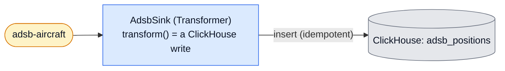

# ClickHouse Sink

A **sink transformer**: it consumes `adsb-aircraft` (example 1's output) and
writes each position into ClickHouse. It is the honest-semantics counterpart to
example 1, which sinks the same topic with ClickHouse's Kafka *engine* — the
shortcut. This example does it the way the framework teaches, so the trade-off
is visible in the code.



## The one teaching point

```
the DB write is a side effect OUTSIDE the Kafka transaction — hence at-least-once
```

A transformer's Kafka transaction is atomic over its **output messages, state,
and offset commit**. An external ClickHouse insert cannot join it. So if the
process crashes after the insert but before the offset commits, the record is
reprocessed and inserted **again**. We make that harmless: every insert carries a
stable `insert_deduplication_token` = `topic:partition:offset`, and the target
table enables `non_replicated_deduplication_window`, so ClickHouse drops a
re-insert whose token it has already seen. Reprocessing converges to exactly the
same rows.

This is a **pure sink**: it emits nothing to Kafka and keeps no state, so its
task transaction only advances the input offset. The insert is the side effect
beside it.

> **Footnote.** ClickHouse's Kafka table engine (example 1) is the shortcut. This
> example uses a sink stage because that is the pattern being taught — and
> because the stage is where you'd add enrichment, routing, or fan-out that the
> engine can't express.

## Run it

Pairs with example 1 (raw-then-refined). With the [stack](../../README.md#the-stack) up:

```bash
uv run poe setup-sink        # ensure the input topic + apply the positions schema
uv run poe run-adsb          # example 1: run the pipeline -> adsb-aircraft
uv run poe run-sink          # this: consume it into ClickHouse, idempotently
```

Then check for the honest-semantics guarantee — total rows equal unique source
records, i.e. no duplicates despite at-least-once. A source record is identified
by its Kafka `partition:offset` (offsets are only unique *within* a partition, and
the input topic has several):

```sql
SELECT count() AS total, uniqExact(source_partition, source_offset) AS unique_records
FROM flechtwerk.adsb_positions;   -- total == unique_records
```

## Tests — the three tiers

```bash
uv run pytest examples/clickhouse_sink                      # tiers 1 + 2 (Docker-free)
uv run pytest -m integration examples/clickhouse_sink      # tier 3 (needs Docker)
```

1. **`tests/logic_test.py` — pure logic.** `to_rows` (projection; departure
   tombstones skipped) and `dedup_token` (reprocessing-stable identity) are plain
   functions, tested directly.
2. **`tests/runner_test.py` — runner tier.** Drives the real
   `TransformerRunner.process_batch` over the shipped fakes and an app-level fake
   ClickHouse writer: positions inserted with the right token, tombstones
   skipped, nothing emitted to Kafka, offset still committed in the task
   transaction.
3. **`tests/integration/` — integration tier.** Against an ephemeral ClickHouse
   (testcontainers): run the sink over a batch, then over the **same batch
   again**, and assert the row count is unchanged — the idempotency claim,
   proven.
