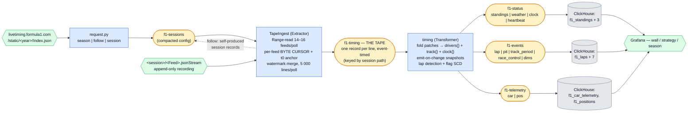

# F1 Live Timing — a Season on Tape

Formula 1's official live-timing feed is recorded, session by session, into a public archive of
append-only files. This example reads those files as a **stream with true event timestamps**,
folds the partial patches they carry into a leaderboard held in keyed state, and puts the result
in Grafana the way a pit wall would: positions, gaps, tyres, flags, strategy. The non-nerd pitch:
*replay any race of the season, or watch a live one, on your own pit wall — and it is the same
dashboard either way.*

It is the repo's answer to a question the others don't ask: *what does a stream look like when
the source is a file that is still being written?*



## What it demonstrates

Three primitives the other examples don't:

1. **The tape is the stream — one extractor for backfill, live, and recovery.** The archive's
   `.jsonStream` files are line-framed and byte-addressable, so a **per-feed byte offset** in
   extractor state is a genuine exactly-once source position. Reading a finished file from byte 0
   is *backfill*; reading a growing file from the last consumed byte is *live tailing*; reading
   from the committed cursor after a crash is *recovery*. They are the same code path, and the
   framework commits the cursor in the same transaction as the records it accounts for, so
   "where am I in the source" and "what have I published" can never disagree.

   The consequence is worth stating on its own: **downtime is lossless.** The source is a file,
   not an ephemeral socket. Stop the stage mid-race and start it an hour later — the cursors
   resume, the missed hour is still in the file, it arrives with its *true* event times, and the
   stage chews through the backlog until it catches the tail. An outage costs timeliness, never
   data.

2. **Delta accumulation into a materialized view.** The feed never sends a leaderboard. It sends
   "car 41's sector 3 was 24.849 and that was lap 28", "car 31 is now +83.497 behind", "car 77
   has stopped". The board folds those patches into per-driver keyed state and emits wide
   snapshots — a materialized view built by *accumulation* rather than by query. And it emits one
   only when a patch actually changed something: 88 % of `TimingData` lines move nothing but a
   marshalling segment's status, so emit-on-change turns a race's ~68 000 timing lines into
   ~37 000 leaderboard rows instead of ~150 000 near-duplicates.

3. **A replayable, deterministic demo.** Every other example in this repo depends on what the
   world is doing right now — no aircraft, no fires, no trains, no race. This one reproduces an
   identical stream on demand: run it on a quiet Tuesday and get the Hungarian Grand Prix, byte
   for byte. A bug reproduces exactly, which makes it the best example to learn the framework
   with.

Secondary, and each earns its keep:

- **A broadcast SCD join.** `TrackStatus` is a **585-byte feed with twelve records per race**, and
  it decides whether every lap time in the session means anything. Correlating it to 37 000
  leaderboard rows in SQL is a range join against an interval table; folding it into the
  transformer's state makes it a plain column, and "the worst flag this lap ran under" becomes a
  `GROUP BY`. See [`board.fold_track`](board.py) and the `clean` column on `f1_laps`.
- **As-of dashboards.** Live, scrub, and animated replay are one Grafana mechanism over true
  event time — no timestamp is ever rewritten. See [The one mechanism](#grafana--the-one-mechanism).
- **Event-time anchoring.** The tape's native clock is a *recording offset*, not a timestamp. The
  ingest stage derives `t0` once per session from the `Heartbeat` feed and persists it as part of
  the cursor. See [Anchoring](#anchoring-t0-and-why-it-is-part-of-the-cursor).
- **An extractor that writes to its own config topic.** `request-f1 follow 2026` seeds one record;
  from then on the stage watches the season index and self-produces a session config for each
  newly-listed session. Config topics are read group-less and `read_committed`, so a record a poll
  writes inside its transaction is picked up by the next config drain — no special case anywhere.

## Quickstart

No credentials of any kind. The archive is public and this example only ever reads it.

```bash
uv run poe up                 # the shared stack (Kafka, ClickHouse, Grafana, Prometheus)
uv run poe setup-f1           # topics + ClickHouse schema; nothing is seeded

# choose some tape — one session, a season, or "watch the season for me"
uv run poe request-f1 session 2026/2026-07-26_Hungarian_Grand_Prix/2026-07-26_Race/
uv run poe request-f1 season 2026            # every competitive session so far
uv run poe request-f1 season 2026 --practice # ... including practice
uv run poe request-f1 follow 2026            # ... and pick up new ones unattended
uv run poe request-f1                        # list what is currently requested

uv run poe run-f1             # both stages, restart-on-crash
```

Then open Grafana at <http://localhost:3000> → **Flechtwerk — F1 Season**, and click a session's
name: **open** puts the race wall on it, **▶ replay** re-runs it at 5×, **📈 strategy** opens the
strategist's view. One race backfills in about two minutes.

To retire something: `uv run poe request-f1 retire <path>` (or `retire season-2026`).

## The tape

Every session in the archive is a directory of feeds:

```
2026/2026-07-26_Hungarian_Grand_Prix/2026-07-26_Race/
    Index.json              33 feeds, each with a KeyFramePath and a StreamPath
    ArchiveStatus.json      {"Status": "Complete"}  ← the completion probe
    TimingData.jsonStream   7 278 940 bytes
    CarData.z.jsonStream    6 535 411 bytes
    ...
```

A `.jsonStream` file is a **recording of the live feed**: CRLF-separated lines, each a fixed
12-character `HH:MM:SS.mmm` offset followed immediately by one JSON value.

```
00:00:00.000{"Status":"1","Message":"AllClear"}
02:13:45.164{"Status":"6","Message":"VSCDeployed"}
```

Six things about it that are not obvious, and that the code has a named place for:

| Trap | What It Costs You |
|---|---|
| **Every file is UTF-8 with a BOM** | and it counts toward the byte offsets, so it is stripped only at offset 0 ([`tape.frame`](tape.py)) |
| **Offsets are relative to the RECORDING, not the session** | recording starts ~50 min before lights-out, so a race's green flag lands around `00:54:00` |
| **Keyframes hold the FINAL state, not the initial one** | `TrackStatus.json` says `AllClear` *after* the race. Replay therefore never reads a keyframe for data — it would start from the end. The one keyframe this example does read is `ArchiveStatus.json`, whose `.jsonStream` twin says `Generating` forever because that is what the live feed said at the time |
| **`.z` feeds are base64 of RAW deflate** | `zlib.decompress(…, -zlib.MAX_WBITS)`; inflated at ingest so nothing downstream needs zlib ([`tape.inflate`](tape.py)) |
| **A collection is an array, then an index-keyed dict** | `"Sectors": [s0, s1, s2]` in a keyframe becomes `"Sectors": {"2": {"Value": "24.849"}}` in every later patch — per field, mid-stream ([`board.indexed`](board.py)) |
| **A session may lack feeds** | a race publishes 33, a qualifying session 27. `LapCount`, `PitStopSeries`, `OvertakeSeries` and `ChampionshipPrediction` are race-only, so the wish list is *intersected* with each session's own index |

Of the 33 feeds, this example ingests **14** (16 with telemetry). What is skipped and why is
listed in [`ingest.WISH_LIST`](ingest.py) — chiefly `TimingDataF1`, a near-duplicate of
`TimingData` carrying ~20× fewer gap updates for the same wall time, and `TimingStats` /
`TyreStintSeries`, both derivable from feeds already ingested.

## Anchoring `t0`, and why it is part of the cursor

An offset alone cannot be a timestamp. The ingest stage's **first poll of a session reads one feed
and emits nothing**: it takes the first `Heartbeat` line, computes `t0 = inner_utc − offset`, and
persists it. Every later line's event time follows from its offset alone.

The anchor poll is deliberately a *peek* — it advances no cursor, so the anchor line itself is
emitted by the next poll's ordinary merge, exactly once, like any other. And `t0` is **persisted
rather than recomputed**, because once the merge has passed the anchor line it is behind the
cursor and unreachable without a rewind.

Two things measured on a real race, both documented in [`tape.anchor`](tape.py):

- **Only the start of the tape is trustworthy for this.** At the end of a recording the offsets
  stop advancing while the heartbeats keep ticking, so the implied `t0` walks forward: over one
  race's 708 beats it spans **1 200 s**, over the first five, **0.18 s**.
- **Absolute placement carries a few seconds of broadcast bias, and no anchor removes it.** For
  the same race, heartbeats imply `12:09:12.47`, `ExtrapolatedClock` implies `12:09:10.34`, and
  `CarData`'s sample clock implies `12:09:09.38` — because a telemetry sample is generated before
  the line carrying it is recorded. Each feed is internally consistent to a fraction of a second,
  so relative order and every duration on the tape are exact.

A session that offers no anchor-capable feed at all is marked done with an error rather than
emitted: a tape that cannot be placed in time would poison the very property the example is about.

## The watermark merge

Each poll range-reads a chunk of every feed, frames whole lines, and emits them **in one merged
order** — but only up to a **watermark**: the minimum, across feeds, of the offset each is known to
be complete to.

Without it, `TimingData` (68 000 lines) would race ahead of `TrackStatus` (12 lines), and laps
would be tagged with a flag state the board had not seen yet. It would look like a bug in the
join rather than in the ordering. The phase difference is one line of code:

- **archive** — a feed read to end-of-file is *exhausted* and drops out of the minimum entirely.
  Otherwise the shortest feed would pin the watermark at its last record and freeze the tape.
- **live** — a feed read to the current end is merely *caught up*. Absence of a line up to now is
  information (a quiet `RaceControlMessages` means no flags, not unknown flags), so its frontier
  becomes `now − 30 s` — a *safe* now, because the CDN takes a moment to serve what the recorder
  has just written.

Cursors advance **only past emitted lines**, never past merely fetched ones, so a line held back
by the watermark is simply re-read next poll and no buffer has to live in state.

**Each feed sizes its own chunk from what it actually got through last time.** The feeds run at
byte rates three orders of magnitude apart — 512 KB is six minutes of `TimingData` but the whole
of `TrackStatus` — so a uniform chunk means most feeds fetch far past the watermark and re-fetch
the surplus every poll. Measured on a real race, that was **~7×** more bytes downloaded than the
tape contains. Asking for twice last poll's consumption instead ([`_retune`](ingest.py)) converges
in two or three polls to **1.63× — 34.8 MB downloaded for a 21.4 MB tape**, over 24 polls and 371
requests, for 93 051 lines.

## The board

`timing` consumes the tape keyed by session path — so one task owns a session's whole stream in
tape order — and holds one bucket of state per session:

```python
{ "meta":    {session_key, meeting, session_name, start_utc, end_utc, label, status},
  "drivers": {racing_number: {tla, position, gap, interval, catching, last_lap, best_lap,
                              sectors[3], speeds{}, in_pit, pit_out, retired, stopped,
                              pit_count, compound, tyre_age, stint, laps,
                              lap_worst, lap_pitted}},   # ≤ 22 entries
  "track":   {code, label, severity, started_at},
  "clock":   {lap, total_laps, remaining_s, extrapolating} }
```

Roughly 3 KB with a full grid — one changelog record, comfortably under the broker's ~1 MB
ceiling. Rules worth knowing:

- **Nothing is emitted before `SessionInfo`.** Every output row carries the numeric `session_key`
  the dashboards filter on, and `SessionInfo` sits at offset ~0 in every tape. Records that beat
  it (a heartbeat or two) are folded into state and emit nothing.
- **A lap completes when `NumberOfLaps` increases.** The feed lands `NumberOfLaps`, `LastLapTime`,
  the third sector and the finish-line speed on **one line**, so a single patch carries both the
  fact and everything about it. Watching `LastLapTime` instead would misfire every time the same
  time is re-sent with only a `PersonalFastest` flag attached.
- **The flag tag is a `max` over a severity order the codes do not have.** `7` (VSCEnding) is
  *less* severe than `6` (VSCDeployed), and `5` (red) outranks everything. Each driver's
  accumulator is also bumped by `fold_track` the moment a flag changes, so a caution that came and
  went between two of that driver's own patches still marks the lap it spoiled.
- **`clean` is the verdict that makes a pace comparison legitimate**: green for the whole lap *and*
  outside the pit lane. In one race, 1 252 of 1 429 laps.
- **The session ends twice.** `SessionStatus` reaches `Finalised` (results official — the final
  classification is emitted here) and then, minutes later, `Ends` (the tape is over — the bucket
  is tombstoned). Tombstoning on the first would throw away the state the remaining lines still
  update.

## Grafana — the one mechanism

Every "current state" panel computes an **as-of cursor** in plain SQL and filters
`event_time <= cursor`, with **no lower bound** (a driver's last update may predate the visible
range, and a leaderboard that forgets a car in the pits is worse than useless):

```sql
WITH if('${mode}' = 'replay',
        fromUnixTimestamp64Milli(toInt64(${race_start_ms}
          + (toUnixTimestamp64Milli(now64(3)) - ${play_ms}) * ${speed})),
        fromUnixTimestamp64Milli(toInt64(${__to}))) AS cursor
SELECT racing_number,
       argMax(position, event_time) AS pos,
       argMax(gap_raw,  event_time) AS gap, …
FROM flechtwerk.f1_standings
WHERE session_key = ${session} AND event_time <= cursor
GROUP BY racing_number ORDER BY pos
```

That single block gives three modes with no special cases:

| Mode | How | What It Is |
|---|---|---|
| **live** | `mode=wall`, now-relative range, 10 s auto-refresh | the cursor is *now* |
| **scrub** | `mode=wall`, absolute range end | drag or arrow-step the range end through a past race and the wall re-forms at that instant |
| **replay** | `mode=replay` | a virtual clock advances the cursor at `${speed}×` from the race start while auto-refresh re-queries |

**No timestamp is ever rewritten.** There is no paced re-emission, no shifted clock, no second
copy of the data — only the cursor moves. That is what makes an archived March race and a live
session the same dashboard, and it is why the topics are retained forever (see below).

Three dashboards:

- **Flechtwerk — F1 Live Timing** (`flechtwerk-f1`) — the race wall: leaderboard, flag banner,
  lap counter, tape freshness, gaps, lap times with flag annotations, battle radar, pit stops,
  race control, weather, speed traps, and a track map.
- **Flechtwerk — F1 Strategy** (`flechtwerk-f1-strategy`) — stint timeline, degradation curve by
  compound over clean laps, position by lap, rolling pace, pit-loss ledger. Lap-indexed, so it
  ignores the time range (except the stint timeline, which says so).
- **Flechtwerk — F1 Season** (`flechtwerk-f1-season`) — the entry point: every session on tape,
  with the three data links, plus championship progression, podiums, and season tallies.

Two Grafana facts worth knowing if you edit these: a stat panel over a **string** field needs
`reduceOptions.fields = "/.*/"` (the default means "numeric only", and the panel reads *No data*),
and Grafana **cannot colour a series from a data field** — `f1_drivers.team_colour` is real data,
but the dashboards bake per-driver overrides into their JSON. Revisit those each season.

## Live, and what is still unverified

The live path is implemented and unexercised: no session was running when this example was
written. The **hypothesis** is that the static files are written *during* the session (they are
how the official client back-fills a late joiner), so live is simply tailing a growing file with
the same cursor — expected markers `ArchiveStatus.Status = "Generating"` and
`SessionStatus ≠ "Finalised"`, both of which the code already keys on.

**The open question is the CDN, not the origin.** The archive is Amazon CloudFront in front of an
S3 origin, and every object probed — including `ArchiveStatus.json`, the completion probe — is
served with `Cache-Control: max-age=3600`. One `TimingData.jsonStream` came back as a plain
`x-cache: Hit` with `age: 3430`: 57 minutes stale, served without revalidating. If a *growing*
file is cached at the edge for an hour, a tail read is blind for far longer than the seconds this
example's latency budget assumes, and no amount of correct cursor arithmetic helps.

That is a question about live behaviour and every object probed was finalised, so it is genuinely
open in both directions. The plausible case for the hypothesis is that the origin sends short or
`no-store` headers *while* a session is recording and switches to `max-age=3600` only once it is
finalised — the official client back-fills late joiners from these same files, and would be
useless otherwise. Objects past their TTL did come back as `RefreshHit from cloudfront`, so the
edge does revalidate; what happens *inside* the window on a file still being appended to is
exactly what nobody has measured.

So, to verify at the next race weekend, across the session start:

1. Does the session path appear in the year index before the session begins?
2. Does `Content-Length` grow — and does it grow **at the edge**? Watch `Cache-Control`, `Age`,
   and `x-cache` on a live `.jsonStream`; an `Age` that climbs past a few seconds on a file that
   is still being written is the hypothesis failing.
3. Does a `Range` read from a stored offset return exactly the appended bytes?
4. What is the real lag between the last line's event time and now?

If the edge behaves (short TTL while live), expect ~15–45 s to the dashboard: CDN, plus a 10 s
poll, plus the 30 s live-frontier margin. If it does not, the ceiling is the TTL and the honest
answer is that this archive is a replay source rather than a live one. `request-f1 session <path>`
works before the index lists the session — the stage treats the 404 as "not started yet" — so you
can be ready either way.

If the hypothesis is wrong and the files only appear post-session, live watching would need a
SignalR client draining into `poll()`. That is deliberately **not** built: it would lose the byte
cursor's exactly-once property and produce provisional rows that a post-session re-ingest would
duplicate. Backfill and replay do not depend on any of this.

## Volume, retention, and politeness

A race is ~21 MB of tape across 16 feeds and **93 051 lines**; `--no-telemetry` drops the two `.z`
feeds and about two thirds of the bytes. A full season of competitive sessions is 30 sessions and
roughly 480 MB downloaded. In ClickHouse one race lands ~37 000 standings rows, ~1 400 laps, and —
with telemetry — ~1.5 M sample rows.

**The four data topics are created with `retention.ms=-1`, and that is correctness rather than
hoarding.** Records carry event-time timestamps that are genuinely months in the past during a
backfill, and Kafka judges a segment by its *maximum* record timestamp — so under the default
seven days a freshly backfilled March race would be eligible for deletion the instant it landed.
The topic would accept the data, report success, and drop it at the next retention pass. There are
no TTLs in ClickHouse either: this is the one example whose value grows with age.

Politeness knobs, all in [`ingest.py`](ingest.py): one shared `httpx` client, an honest
`User-Agent`, sequential reads per session, self-tuning chunk sizes, and **`Accept-Encoding:
identity` on every stream request — mandatory**, because transparent gzip would make the bytes the
server counts differ from the bytes we count and every cursor in state would silently point at the
wrong place. A completed session's poll issues **no request at all**.

## Legal posture

The live-timing endpoint is **unofficial and undocumented**. It is unauthenticated and used
read-only by a wide ecosystem of tools; this example is read-only, identifies itself, and paces
itself. Access is granted per season and can be withdrawn: the archive already answers **HTTP 403
for 2022**, which `request-f1` reports as the real answer it is — and which is the standing
argument for the topics' unlimited retention, since a season you have ingested stays ingested.

This project is **unofficial and is not associated in any way with the Formula 1 companies**.
F1, FORMULA ONE, FORMULA 1, FIA FORMULA ONE WORLD CHAMPIONSHIP, GRAND PRIX and related marks are
trade marks of Formula One Licensing B.V.

## Extension points

- **A SignalR push extractor**, if §"Live" turns out to need one — the transport-agnostic
  push-source shape this repo has been circling.
- **Qualifying segments.** `SessionData` carries the Q1/Q2/Q3 knockout structure. The leaderboard
  works generically off position patches today; a segment-aware board could show eliminations.
- **Sector-level personal/overall-fastest colouring.** `TimingData` carries the flags per sector;
  they ride on the tape's `payload` but are not promoted. Re-run the board with a fresh
  application id to add a column without re-downloading a byte — which is the point of keeping the
  tape.
- **Multi-season backfill.** Works by construction (2018–2021 and 2023–2026 were readable when
  this was written); untested here.

## Files

| File | What |
|---|---|
| [`tape.py`](tape.py) | pure core: framing, BOM, inflate, the `t0` anchor, frontiers, the watermark merge |
| [`board.py`](board.py) | pure core: patch merging, gap/duration parsing, lap detection, the flag SCD |
| [`ingest.py`](ingest.py) | the Extractor: byte cursors, phases, chunk tuning, the season-follow target |
| [`timing.py`](timing.py) | the Transformer: fold, emit-on-change, three output streams |
| [`attributes.py`](attributes.py) | typed attributes, topics, state keys |
| [`request.py`](request.py) | choose sessions; prints what it will seed and what it will cost |
| [`setup.py`](setup.py) | topics (incl. `retention.ms=-1`) + the ClickHouse schema |
| [`clickhouse.sql`](clickhouse.sql) | three Kafka-engine queues → 14 tables via materialized views |
| [`tests/`](tests) | the three tiers, over a 12 KB miniature session built from real archive lines |

Data © Formula One Licensing B.V., read from a public endpoint. Not for betting, and not a
substitute for the official timing screens.
