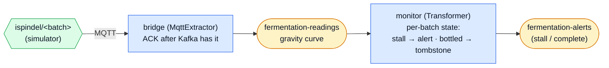

# Fermentation Monitor — MQTT Bridge

The push-driven showcase: an **`MqttExtractor`** bridges iSpindel/Tilt hydrometer
readings from MQTT into Kafka — **ACKing the broker only after Kafka has the
data** — and a stateful transformer tracks each batch's gravity curve, alerting
on a stall and tombstoning the batch when fermentation finishes.



## What it demonstrates

- **ACK after Kafka, not before.** The bridge is the framework's MQTT template:
  it forwards each reading, and ACKs it to the broker only on the *next* poll —
  once the batch is durable in Kafka. Crash in between and the broker redelivers
  (at-least-once); the `relay` itself is a pure function.
- **Stateful per-batch analysis.** The monitor keeps each batch's gravity curve
  as `State`. Flat gravity for too long → a **stall** alert. Reaching final
  gravity → a **complete** alert and a **tombstone** (a falsy `State` that
  deletes the batch's state and writes a changelog tombstone) — the genuine
  state-tombstone, unlike example 1's data-topic marker.
- **No hardware.** A simulator publishes realistic descending gravity curves;
  one batch ferments cleanly, one stalls.

## Run it

With the [stack](../../README.md#the-stack) up, in four terminals (or background
the two long-running ones — the bridge and the monitor):

```bash
uv run poe fermentation              # quickstart: setup + bridge + monitor + simulator (no hardware)
# ...or step by step:
uv run poe setup-fermentation        # topics, batch configs, ClickHouse schema
uv run poe run-fermentation          # the MQTT→Kafka bridge
uv run poe run-fermentation-monitor  # the stateful gravity monitor
uv run poe simulate-fermentation     # publish hydrometer readings (no hardware)
```

Then look at ClickHouse / Grafana (*Flechtwerk — Fermentation Monitor*):

```sql
SELECT batch, count() AS points, max(gravity) AS start_sg, min(gravity) AS latest_sg
FROM flechtwerk.fermentation_readings GROUP BY batch;          -- the gravity curves
SELECT batch, kind, gravity FROM flechtwerk.fermentation_alerts ORDER BY at;
-- batch-42 | complete | 1.008
-- batch-43 | stall    | 1.035
```

## Tests — the three tiers

```bash
uv run pytest examples/fermentation_monitor                     # tiers 1 + 2 (Docker-free)
uv run pytest -m integration examples/fermentation_monitor     # tier 3 (needs Docker)
```

1. **`tests/logic_test.py` — pure logic.** The relay (payload → reading) and the
   monitor (gravity curve → stall alert, completion → tombstone) as plain
   functions / a driven generator.
2. **`tests/runner_test.py` — runner tier.** The bridge against
   `FakeMqttConnection`, pinning **ACK-after-Kafka** (a batch is ACKed only on
   the next poll); the monitor through `TransformerRunner.process_batch`,
   pinning the stall alert.
3. **`tests/integration/` — integration tier.** The real `MqttExtractor` via
   `Flechtwerk.run()` against ephemeral Mosquitto + Kafka: publish over MQTT,
   assert the reading lands on `fermentation-readings`.
