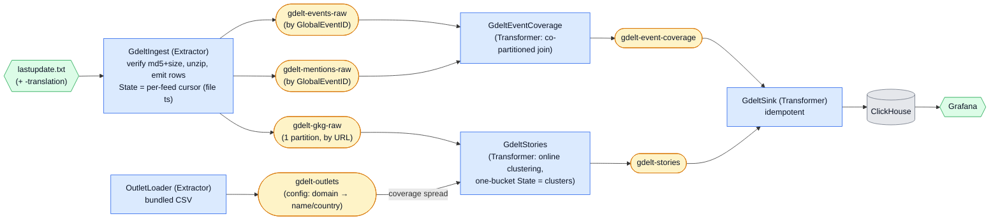

# GDELT News Stories

A multi-stage pipeline over the **GDELT 2.0** 15-minute news feed that turns GDELT's
pre-enriched article/event distillate into **stories** (clusters of articles covering the
same event) and **coverage analytics** (who is covering what, breaking-news spikes, how
globally a story is carried), sunk to ClickHouse and shown in Grafana.

<p align="center">
  
</p>
<p align="center"><em>Live in Grafana: breaking-news velocity, a tone-coloured world map, and top stories by coverage.</em></p>



## What it demonstrates

Four primitives the other examples don't:

1. **Batch-file firehose ingestion.** `GdeltIngest` polls an immutable, timestamped file
   series and uses `State` as a **resume cursor** — the last fully-processed 15-minute
   slice, per feed. Contrast ADS-B's live, un-replayable API and fermentation's MQTT push:
   here the source is re-readable history, and the cursor is the whole story. Emit the
   slice's rows first, the cursor last → the slice and its cursor commit in one transaction;
   crash mid-slice and the re-poll re-emits it (**at-least-once** into Kafka).
2. **Co-partitioned stream–stream join.** `GdeltEventCoverage` joins Events ⋈ Mentions on
   `GlobalEventID`. Both raw topics are keyed identically and share a partition count, so an
   event and every mention of it land on the same task/state bucket — the framework's
   co-partitioning contract, which *is* the join.
3. **Online clustering in keyed state.** `GdeltStories` groups GKG articles into stories by
   thresholded feature-set similarity (overlap coefficient over persons ∪ orgs ∪ top themes),
   with URL dedup and TTL eviction — all in one keyed-state bucket.
4. **Config-topic enrichment (GlobalKTable-style).** `OutletLoader` publishes a bundled
   outlet table to the compacted `gdelt-outlets` config topic; `GdeltStories` joins it as a
   lookup to annotate each story's **coverage spread** (how many distinct countries' outlets
   carry it).

Three lessons worth naming explicitly:

- **Event time is the file timestamp, never `SQLDATE`.** GDELT's `SQLDATE` is machine-coded
  and observed a *year* stale on current articles (a regression fixture pins two such rows).
  Every row in one file shares the file timestamp (`DATEADDED`), so windows are exact — the
  pipeline reads `metadata.file_ts` and ignores `SQLDATE` entirely.
- **Out-of-order buffering.** A mention can arrive before its event row. Coverage buffers the
  orphan mention (emitting `event_seen = 0`), reconciles when the event lands, and — so the
  store can't leak — **tombstones** an orphan that ages past a 48 h TTL (a falsy `State`).
- **Single-partition clustering, honestly.** Online clustering needs every article visible
  to every cluster, so `gdelt-gkg-raw` is a **single-partition** topic and `GdeltStories`
  overrides `extract_state_key` to a **constant** — all clusters live in one bucket on one
  task. That one bucket is one changelog record, and Kafka caps a record at ~1 MB, so the
  bucket is **TTL-pruned and hard-capped** (`MAX_CLUSTERS` / `MAX_SEEN_URLS`) to stay under
  it. At the English feed's volume (~1–2k GKG records / 15 min) this is correct and
  sufficient. The production path for higher volume is a *blocking key* (dominant country or
  top theme) that shards clusters across partitions; we deliberately don't build it — that is
  exactly what you'd reach for if you enable the translation feed (below) or scale up.

## What is GDELT

The **Global Database of Events, Language, and Tone** is a firehose of *derived* news data:
it monitors ~189k outlets in ~100 languages and, every 15 minutes, publishes three
tab-delimited tables — coded **Events**, article **Mentions** of those events, and a
**Global Knowledge Graph** of per-article entities/themes/tone — plus the article URLs. It
is analysis and pointers, **not** article text (there is no NLP re-extraction to do here;
GDELT already did it — the point is the streaming layer on top). All URLs are plain HTTP GET,
no key, no quota. A parallel machine-translated feed (`lastupdate-translation.txt`) carries
the non-English world press; it is **off by default** (`INCLUDE_TRANSLATION` in `setup.py`) —
it roughly doubles per-slice volume and its machine-translated GKG entities are noticeably
noisier, so enabling it is where you'd move to a sharded clustering key. Codebooks:
[Events][ev], [Mentions][mn], [GKG][gkg].

[ev]: http://data.gdeltproject.org/documentation/GDELT-Event_Codebook-V2.0.pdf
[mn]: http://data.gdeltproject.org/documentation/GDELT-Mentions_Codebook-V2.0.pdf
[gkg]: http://data.gdeltproject.org/documentation/GDELT-Global_Knowledge_Graph_Codebook-V2.1.pdf

## Run it

With the [stack](../../README.md#the-stack) up:

```bash
uv run poe gdelt        # setup (topics + feed/outlet configs + schema) then run all five stages
```

or step by step:

```bash
uv run poe setup-gdelt          # topics + feed/outlet configs + ClickHouse schema
uv run poe run-gdelt-outlets    # publish the bundled outlet table -> gdelt-outlets
uv run poe run-gdelt-ingest     # poll GDELT -> gdelt-{events,mentions,gkg}-raw
uv run poe run-gdelt-coverage   # Events x Mentions join -> gdelt-event-coverage
uv run poe run-gdelt-stories    # cluster GKG -> gdelt-stories
uv run poe run-gdelt-sink       # sink stories + coverage -> ClickHouse (idempotent)
```

GDELT publishes a new slice every 15 minutes, so the **GDELT News Stories** Grafana
dashboard fills within ~15–30 min of wall-clock time: breaking-news velocity, a top-stories
table (entities, outlets, countries, tone), a tone-coloured world map from the events'
`ActionGeo` coordinates, and a single-country coverage panel. Browse the topics in
[Kafbat UI](http://localhost:8080) meanwhile.

## Extension points (deliberately not shipped)

- **Editorial leaning / bias.** The outlet table is objective metadata only (domain, name,
  country). A Ground-News-style *leaning* column would plug straight into `outlets.csv` and
  `schema.OUTLET_*`, giving a per-story left/right coverage split — left out because the
  ratings carry baggage this demo won't take on.
- **Bounded backfill.** `masterfilelist.txt` lists every slice back to 2015; a date-range
  config over the same extractor path would replay history. Out of scope by default.
- **Sharded clustering.** See the single-partition note above — the blocking-key shard is the
  production path, not built here.
