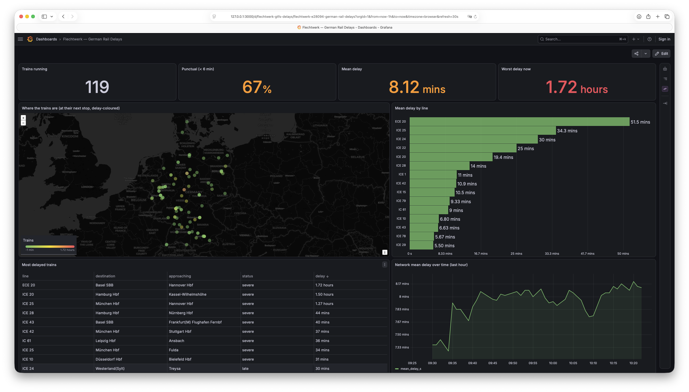
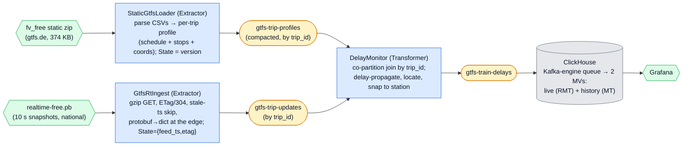

# GTFS Delay Monitor

A multi-stage pipeline over Germany's free open transit data that turns the national
**GTFS-Realtime** feed into a live **delay/disruption monitor** for long-distance rail:
where every ICE/IC is right now, how late it is, and how punctual the network is — sunk
to ClickHouse and shown in Grafana.

<p align="center">
  
</p>
<p align="center"><em>Live in Grafana: ~120 long-distance trains placed at their next stations and coloured by delay, network punctuality (DB's &lt; 6 min "pünktlich"), the worst-delayed trains, and mean delay over time.</em></p>



## What it demonstrates

Primitives the other examples don't:

1. **Binary (protobuf) source, decoded at the edge.** GDELT parses tab-delimited files
   and ADS-B an HTTP JSON API; here `GtfsRtIngest` decodes a **GTFS-Realtime protobuf**
   snapshot inside `poll()` (`gtfs-realtime-bindings` → `MessageToDict`) and yields
   ordinary `Event`s. **The framework never sees protobuf** — JSON stays the only Kafka
   wire codec, so a binary source needs *no* framework change. (The one wrinkle worth
   knowing: `MessageToDict` renders proto `int64` as a JSON *string* and enums as their
   name — carry those verbatim, coerce only where you compute, exactly as ADS-B keeps
   `alt_baro` faithful.)
2. **A stream joined against a static *dimension* table.** GDELT joins two *streams*
   (Events ⋈ Mentions); this joins the live update stream against the **schedule**. The
   schedule is data, not config — far too large for the framework's in-memory global
   config store — so the loader publishes one **profile** per trip (its stops, times,
   and coordinates) to a compacted `gtfs-trip-profiles` topic, **co-partitioned** with
   `gtfs-trip-updates` by `trip_id`. A profile message stores the profile as that trip's
   keyed state; an update reads it back and computes against it. That *is* the join.
3. **A self-healing snapshot source — the deliberate contrast with GDELT coverage.**
   GDELT must *buffer* an orphan mention because its event row never re-arrives. Here the
   RT feed re-sends the **full snapshot every ~10 s**, so an update that arrives before
   its profile is simply **dropped** — the next snapshot re-delivers it once the profile
   is in place. No orphan buffer, no TTL, no tombstone.
4. **Deriving what the source won't give you.** Event-time delay propagation (a sparse
   `StopTimeUpdate`'s delay carries to later stops until the next one), dwell/skip
   handling, and DST-correct schedule anchoring — all pure functions, all driven by the
   feed's own header timestamp, never wall-clock.

## Delays, not positions — and why

The obvious idea is to show *moving trains on the map*. German open data won't support
it honestly, and finding that out was the point of the recon:

- **No free route geometry.** No gtfs.de tier (`fv_free`, `rv_free`, or the 254 MB
  `de_full`) ships `shapes.txt` — geometry is the paid tier. Without a polyline there is
  nothing to interpolate a between-stops position *along*.
- **No live positions.** The GTFS-Realtime feed carries `TripUpdate`s and
  `ServiceAlert`s only — **no `VehiclePosition`** entities.
- **The APIs that could supply polylines are blocked.** DB's HAFAS/`vendo` endpoints
  (via `transport.rest` / a self-hosted `db-vendo-client`) return `OPS_BLOCKED` to
  datacenter IPs — so any such dependency fails on CI and in the stack anyway.

So the train is placed at **its next station's coordinates** — an honest, *derived*
position ("approaching Hannover Hbf, +6 min"), not a fake trajectory across the
countryside. What the data *is* rich in is **delays** (live long-distance delays span
from a few minutes early to hours late), and that is what this example makes live.
Real geometry, if you want it later, means routing station-pairs over an OpenStreetMap
rail extract — see the extension points.

## The data

**gtfs.de** republishes the official **DELFI** dataset as GTFS. Two free feeds, both
plain HTTP, no key, **CC-BY 4.0**:

- **Static** `download.gtfs.de/germany/fv_free/latest.zip` — the long-distance schedule
  (EC/IC/ICE, `route_type=2`): stops with coordinates, arrival/departure times, and line
  numbers. Tiny (~374 KB, ~5k trips/day). The loader's `ETag` is its resume cursor.
- **Realtime** `realtime.gtfs.de/realtime-free.pb` — the national GTFS-Realtime feed,
  refreshed every ~10 s. It is national and un-filterable server-side (~52 MB/snapshot),
  so ingest polls it every **60 s** with gzip and skips a snapshot whose header timestamp
  hasn't advanced; scoping to long-distance happens **downstream**, where the delay join
  drops any trip without a long-distance profile.

Attribution: *Data © DELFI e.V., provided by gtfs.de, licensed CC-BY 4.0.*

## Run it

With the [stack](../../README.md#the-stack) up:

```bash
uv run poe trains        # setup (topics + feed configs + schema) then run all three stages
```

or step by step:

```bash
uv run poe setup-trains        # topics + feed configs + ClickHouse schema
uv run poe run-trains-loader   # load the fv static feed -> gtfs-trip-profiles
uv run poe run-trains-ingest   # poll the RT protobuf feed -> gtfs-trip-updates
uv run poe run-trains-delays   # join updates x profiles -> gtfs-train-delays
```

The loader publishes profiles once at startup; ingest picks up a fresh snapshot within a
minute, so the **German Rail Delays** Grafana dashboard fills within ~1–2 min: a
delay-coloured map of ~130 concurrent ICE/IC trains at their next stations, network
punctuality (DB's "pünktlich" = under 6 minutes late), the most-delayed trains, mean
delay by line, and a network-delay timeseries. Browse the topics in
[Kafbat UI](http://localhost:8080) meanwhile.

## Extension points (deliberately not shipped)

- **Regional / national scope.** Point the `gtfs-static-sources` config at `rv_free` or
  `de_full` and widen `loader.RAIL_ROUTE_TYPES` — a denser, busier map. National needs a
  paged loader (a version+offset cursor) since a single-transaction rebuild of ~1.6M
  trips is too large.
- **Real positions via OpenStreetMap.** Route each station-pair over an OSM
  `railway=rail` extract to synthesise a polyline (keyed to the stop coordinates we
  already have), then interpolate — self-contained, no blocked APIs, real track shape.
- **Disruptions feed.** The RT feed's `ServiceAlert`s are ignored (their text came back
  empty in the free feed); wire them to a second topic + table once their fields are
  understood.
- **Punctuality history.** The `gtfs_delay_history` table is TTL-pruned at a day; roll it
  up for on-time-percentage trends by line or hour.
