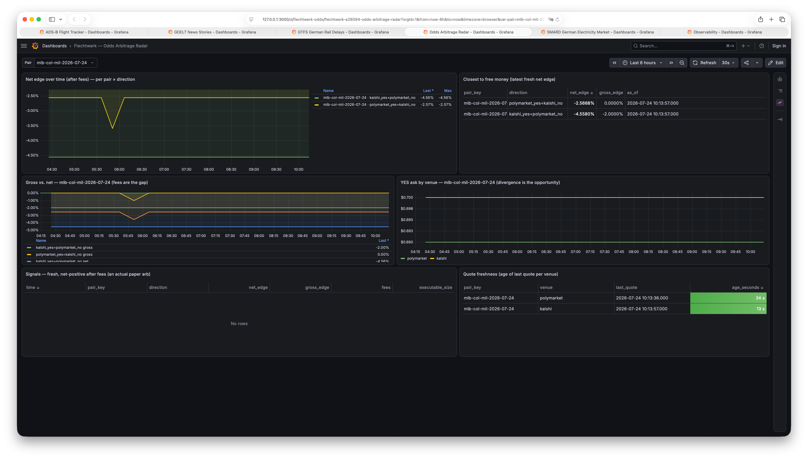
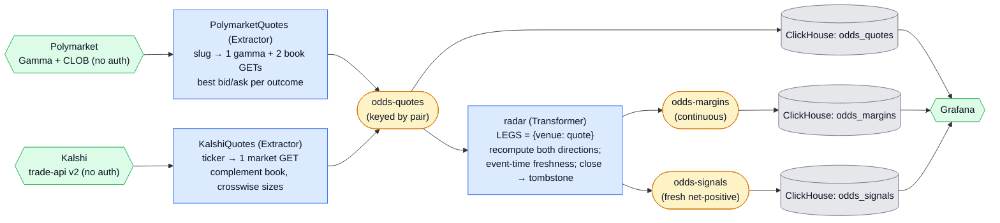

# Odds Arbitrage Radar — Polymarket × Kalshi

Two independent extractors poll two prediction-market venues for the **same** real-world
events, normalize both order books into one pair-keyed quote stream, and a transformer merges
them into a per-pair best-price state that watches for **cross-venue arbitrage**: a moment
when buying YES on one venue and NO on the other costs less than the guaranteed $1 payout. It
emits a continuous **margin** stream (the "distance to free money", always interesting to
watch) and a sparse **signal** stream when a *fresh*, fee-adjusted, net-positive edge actually
appears. It is the repo's answer to a question the others don't ask: *how do you fan many
sources into one materialized view and act on a derived condition — without letting a stale
input lie to you?*

<p align="center">
  
</p>
<p align="center"><em>Live in Grafana: the net edge after fees per pair × direction, the closest-to-free-money leaderboard, gross vs. net (the gap is the fees), the two venues' YES asks, and quote freshness. The signals table stays empty until a fresh net-positive edge actually appears — which is the honest state most of the time.</em></p>



## What it demonstrates

Primitives the other examples don't:

1. **N-source fan-in to one keyed, materialized state.** Two *independent extractor
   processes* — `polymarket` and `kalshi` — consume the **same** compacted config topic
   (`odds-pairs`) and produce normalized quotes to the **same** partitioned topic
   (`odds-quotes`), both keyed by the pair. So a pair's quotes from both venues hash to one
   partition → one `radar` task → one state bucket, and a single `transform` sees them one at
   a time against the accumulating `LEGS = {venue: latest quote}`. SMARD and GTFS join two
   *streams*; this merges N *sources* into a "watchdog" view and recomputes a derived
   condition on every update. (Two extractors sharing a config topic just works — each joins
   its own `application_id` consumer group for ownership leases; the data plane reads all
   configs group-less.)
2. **Event-time staleness — a stale input must not lie.** Quotes carry the poll's server
   `Date` as `fetched_at`. When one venue's quote triggers a computation, the radar compares
   its event time against the *other* leg's stored event time; if the other is older than
   `STALE_AFTER` (5 min ≈ 10 polls), every margin from that update is flagged `fresh = false`
   and **cannot signal**. A 10-minute-old quote will never manufacture an arb against a fresh
   one. The margin still flows (the chart wants continuity) — only the alert is gated. This is
   the counterpart to SMARD's stream-time punctuation: the framework has no timers, so the
   *pollers* stamp the clock and the transformer reasons about it.
3. **A lifecycle-bounded join state.** When either venue reports the market `closed` (settled,
   halted, delisted), the radar tombstones the pair's join state with a falsy `State()` —
   keeping the store bounded to live markets, the way SMARD's `settled` marker bounds its
   window. (If the other venue keeps quoting after that, it rebuilds a one-legged state that
   computes nothing and tombstones again on its own close — bounded, self-limiting.)

And two things worth seeing in the numbers:

- **Symmetric one-contract-per-leg math.** A binary contract pays $1. Buy one YES on venue A
  at ask `a` and one NO on venue B at ask `b` for the same event: exactly one pays $1
  regardless of outcome, so `a + b < 1` is risk-free profit — **no stake-splitting** (that is
  the decimal-odds bookmaker case; fixed-$1 binaries hedge one-for-one). See `arbitrage.py`.
- **Gross vs. net.** Both venues charge the same parabolic taker fee `rate · p · (1 − p)`,
  peaking at `p = 0.5`. A visible *gross* edge is routinely smaller than the fees, so the
  **net** edge is what a signal is made of — see the worked example below.

## A worked example (captured live, 2026-07-23)

During a MIN@CLE MLB game, in-game:

- Kalshi "Cleveland wins" — best ask **$0.76**.
- Polymarket "Minnesota" (= Cleveland NO) — best ask **$0.22** (it drifted to $0.30 within ~10
  minutes; in-game prices move fast — exactly the divergence the radar watches).
- **Gross**: `1 − (0.76 + 0.22) = 0.02` → a 2 ¢ guaranteed edge per contract pair.
- **Fees**: Kalshi `0.07·0.76·0.24 ≈ 1.28 ¢` + Polymarket `0.05·0.22·0.78 ≈ 0.86 ¢ ≈ 2.1 ¢`.
- **Net**: `≈ −0.1 ¢` — the fees ate it.

That is the lesson, live: real gross edges open constantly, and fees close most of them. The
committed test fixtures (a Colorado @ Milwaukee game) show the same shape — a +1 ¢ gross edge,
net-negative after fees.

## The data

Both venues expose **keyless, read-only** market data (no API key, no auth for reads):

- **Polymarket** — two endpoints. *Gamma* (`https://gamma-api.polymarket.com/markets?slug=…`)
  returns the market's metadata; its `outcomes` and `clobTokenIds` are JSON arrays delivered
  **as strings** (double-encoded), one CLOB token per outcome in order. *CLOB*
  (`https://clob.polymarket.com/book?token_id=…`) returns each outcome's order book — levels
  **unsorted**, so best bid = max price, best ask = min price; either side may be empty. Gamma
  also has `bestBid`/`bestAsk`/`takerBaseFee` fields, but their semantics are under-documented,
  so this example ignores them and reads the CLOB books directly. (3 GETs per pair per poll.)
- **Kalshi** — one endpoint
  (`https://api.elections.kalshi.com/trade-api/v2/markets/<ticker>`). The market object
  carries top-of-book as **dollar strings**. Kalshi runs one book per market shown from both
  sides — `no_ask = 1 − yes_bid` — so the NO side's sizes are **crosswise** (the size at
  `no_ask` is `yes_bid_size_fp`, the same resting order seen from the other side). A side with
  no order reports `"0.0000"`, treated as absent. (~30 req/s public limit; 1 GET per pair.)

**Fees.** Polymarket taker fee is category-dependent — 0.00 (geopolitics), 0.04
(finance/politics), **0.05 (sports)**, 0.07 (crypto), makers free. Kalshi's general-markets
taker fee is `round_up(0.07 · C · p · (1 − p))` per order. The radar models the smooth
per-contract rate (Kalshi's per-order cent-rounding is a small real-world discrepancy we do
not model); the rate rides on each quote (module default or a per-pair config override), so
the math stays a pure function of its inputs.

**Finding and requesting pairs.** A *pair* is your curated claim that one Polymarket market
and one Kalshi market resolve the *same* event, with `yes_outcome` naming the Polymarket
outcome that lines up with Kalshi's YES side. Browse [polymarket.com](https://polymarket.com)
and [kalshi.com](https://kalshi.com) for the same game, or list live markets:

```bash
curl 'https://gamma-api.polymarket.com/events?tag_slug=mlb&active=true&closed=false&limit=5'
curl 'https://api.elections.kalshi.com/trade-api/v2/markets?limit=20&status=open&series_ticker=KXMLBGAME'
```

then request the pair (it is **validated live** before it is written — see below):

```bash
uv run poe request-pair mlb-col-mil-2026-07-24 KXMLBGAME-26JUL261410COLMIL-MIL "Milwaukee Brewers"
```

## Run it

With the [stack](../../README.md#the-stack) up:

```bash
uv run poe odds          # setup (topics + schema) then run all three stages
```

or step by step:

```bash
uv run poe setup-odds            # topics + ClickHouse schema (nothing seeded)
uv run poe request-pair …       # curate one or more pairs (validated); see above
uv run poe run-odds-polymarket   # poll Polymarket books -> odds-quotes
uv run poe run-odds-kalshi       # poll Kalshi markets   -> odds-quotes
uv run poe run-odds-radar        # fan-in quotes -> odds-margins / odds-signals
```

With **zero pairs** the stages idle politely — nothing is seeded, because a pair is a human
judgment call (above). Once you request one, within ~60 s quotes appear on `odds-quotes`,
margins on `odds-margins`, and the **Odds Arbitrage Radar** dashboard plots the net-edge series
per pair and direction. Signals appear only if the market gods smile — so the board is built
around the continuous margins (a "closest to free money" leaderboard), not the rare signal.
Browse the topics in [Kafbat UI](http://localhost:8080); a hand-produced `odds-pairs` record
works too. `request-pair` prints both books and the current edges, and **warns loudly if a
resting net edge exceeds 3 %** — almost always a sign that `yes_outcome` is mapped to the
wrong side (which inverts every margin). Retire a pair with `uv run poe request-pair retire
<slug>` (a compacted-topic tombstone).

## Caveats (read these)

- **Resolution-criteria mismatch is the real risk, and it lives outside the code.** Two venues
  can word or settle "the same" event differently — a postponement, a walkover, a disputed
  result. A cross-venue arb assumes *identical* resolution; when that assumption breaks, the
  "risk-free" pair isn't. This is precisely **why pairs are user-curated**, not auto-matched:
  a human vouches that the two markets truly resolve together. Treat every signal as "worth a
  human look", not "free money".
- **Top-of-book only.** The radar reads the best level on each side and reports
  `executable_size` (the smaller of the two legs' top-of-book sizes). Depth beyond that — how
  fast the edge decays as you take size — is out of scope.
- **Fee model is smooth; Kalshi rounds per order** to the next cent, so its real fee is
  slightly higher on small orders than the modeled `rate · p · (1 − p)`.
- **Quotes are a heartbeat, not a diff.** Unlike SMARD (which emits only *changes*), each
  extractor emits a quote every poll even if unchanged — the freshness logic and the flat-line
  charts need the heartbeat. Volume is trivial (a couple of records per pair per 30 s).

## Responsible use

This example **observes public prices and never places an order** — there is no trading code,
no credentials, no venue account. It is a stream-processing demo that happens to use betting
odds as a lively, fast-moving data source. Whether you may trade on these venues, and the tax
and legal treatment if you do, depends on your jurisdiction; that is entirely outside this
repo's scope.

## Extension points (deliberately not shipped)

- **Intra-venue multi-outcome (`negRisk`) arb.** Polymarket's negative-risk markets let the
  best asks across mutually exclusive outcomes sum to `< 1` — a one-venue arb needing no
  cross-venue entity resolution at all. (This example rejects `negRisk` markets; that is the
  natural follow-up.)
- **Bring-your-own-key real bookmakers.** [The Odds API](https://the-odds-api.com/) aggregates
  40+ real sportsbooks (free tier ~500 credits/mo) and does the event entity-resolution for
  you — a "real bookie" mode behind an API key. Deliberately not the default: it would break
  the repo's keyless-public-data convention.
- **WebSocket push.** Both venues offer WebSocket feeds; a push-driven extractor (the
  framework's `wakeup` event) would replace the 30 s poll and catch line moves the instant
  they happen — the motivating case for the framework's deferred push-source direction.
- **A margin-of-safety threshold.** Raise `radar.MIN_EDGE` above 0 to demand net edge beyond
  fees before signalling — a buffer for slippage and the resolution-mismatch risk above.
