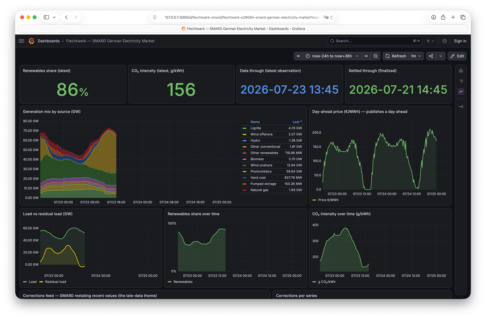
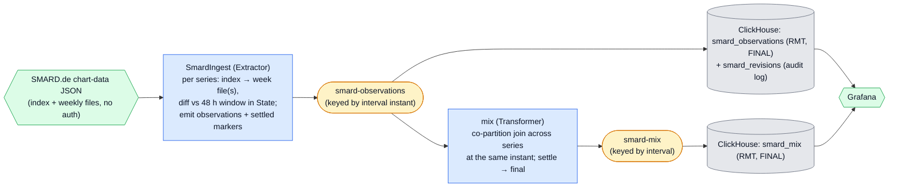

# SMARD German Electricity Market — Late Data, Done Right

A two-stage pipeline over the Bundesnetzagentur's public **SMARD.de** data — Germany's
electricity generation by source, grid load, and day-ahead prices — that turns a source
which **revises already-published numbers** into a live generation-mix board, plus a
**corrections feed** that makes the revisions visible. It is the repo's answer to the one
question the other examples don't: *what happens when the past changes?*

<p align="center">
  
</p>
<p align="center"><em>Live in Grafana: the generation mix by source (GW), the day-ahead price into tomorrow, load vs residual load, renewables share and CO₂ intensity, and — the late-data payoff — a live feed of the values SMARD restates.</em></p>



## What it demonstrates

Primitives the other examples don't:

1. **A source that revises already-published data — and a pipeline that absorbs it.**
   SMARD restates recent quarter-hours as the grid operators reconcile their metering.
   `ingest` keeps a **48 h revision window** in per-series state and diffs each fresh
   snapshot against it: a value it hasn't seen is a first publication; a value that
   *changed* is a revision, re-emitted carrying its `previous_value`. ClickHouse upserts
   the correction (a `ReplacingMergeTree` versioned by `fetched_at`) so the current best
   value wins, while a separate audit table keeps every restatement — the corrections
   feed on the dashboard.
2. **The legitimate use of extractor state as a cursor.** ADS-B keeps *no* cursor (a
   stateless replay source); here the window *is* the cursor — "what's new" is exactly
   "what the fresh snapshot says that the window doesn't." No separate high-water mark.
3. **Stream-time punctuation, emitted by the stage that owns the clock.** Flechtwerk
   transformers are purely event-driven — there is no timer. So the **poller** emits the
   punctuation: as an interval ages past the window's trailing edge it can no longer
   change, and `ingest` emits a `settled` marker for it. The `mix` transformer turns that
   into the interval's **final** record and tombstones its join state — a
   preliminary → revised → final lifecycle, with the state store bounded to the live
   window instead of growing one key per quarter-hour forever.
4. **A co-partitioned join whose key is _time_.** GDELT joins on `GlobalEventID`, GTFS on
   `trip_id`; here every series' observation for one instant shares the interval key, so
   they co-partition onto one `mix` task and fold into one generation-mix record —
   total generation, renewables share, an (illustrative) CO₂ intensity, load, and price.

## The settlement design — why the extractor emits the punctuation

The natural instinct is a timer in the transformer: "if I haven't seen an update for
interval *T* in a while, finalize it." Flechtwerk has no such timer, and that is the
right constraint — a transformer only wakes on input. The stage that *does* have a clock
is the poller, so **it** decides when an interval is done: once *T* falls out of the 48 h
revision window it can never be corrected again, so `ingest` emits a `settled` marker.

Exactly one series drives this (grid load — it always has fresh data, so its intervals
age out on schedule). Because a single ingest process holds one transactional producer,
production order equals per-partition offset order, and every series' window uses the
same process clock: if *T* has aged out for the marker series' poll, it has aged out for
every later poll — so **no revision for *T* can be produced after *T*'s marker**. The
finalization is race-free for a single ingest instance (running several would need
per-series markers). One accepted residue: a data gap in the marker series leaks that one
interval's tiny join state — self-limiting, and documented in `mix.py`.

## The data

**SMARD.de** is the electricity-market data platform of the **Bundesnetzagentur** (the
German federal network agency). Plain HTTP, no key, **CC BY 4.0**:

- An **index** per series — `chart_data/{filter}/{region}/index_{resolution}.json` →
  the list of weekly data-file timestamps that exist. The index is the only authority on
  which files exist, so a **dead series** (nuclear, filter 1224, ended 2024) is a cheap
  no-op, not a special case — nothing intersects the window.
- A **week file** — `chart_data/{filter}/{region}/{filter}_{region}_{resolution}_{ts}.json`
  → 672 quarter-hour `[epoch_ms, value|null]` slots. Values are **MWh per quarter-hour**
  (×4/1000 = average GW) for generation and load, **€/MWh** for the day-ahead price.

Two properties shape the design: values are **revised** for ~2 days after publication
(the whole point), and **day-ahead prices are published a day early** (a week file holds
values into tomorrow — the pipeline must not assume `ts ≤ now`). The default basket is
the 11 generation sources + grid load + residual load (region `DE`) and the day-ahead
price (region `DE-LU`, the German-Luxembourg bidding zone).

Attribution: *Data © Bundesnetzagentur | SMARD.de, licensed CC BY 4.0.* The CO₂ intensity
figures in `mix.SOURCE_META` are **illustrative** (IPCC AR5 lifecycle medians; lignite an
engineering estimate) — a plausible weighting for the demo, not an official statistic.

## Run it

With the [stack](../../README.md#the-stack) up:

```bash
uv run poe smard        # setup (topics + series configs + schema) then run both stages
```

or step by step:

```bash
uv run poe setup-smard        # topics + series configs + ClickHouse schema
uv run poe run-smard-ingest   # poll each series, diff the window -> smard-observations
uv run poe run-smard-mix      # join series by interval -> smard-mix (preliminary -> final)
```

Within ~3 min the **SMARD German Electricity Market** dashboard fills: a week of
generation mix by source, the day-ahead price running into tomorrow, load vs residual
load, renewables share and CO₂ intensity. **Settlement is visible almost immediately** —
intervals that were already ~48 h old at startup age out within the first few polls, so
`SELECT max(ts) FROM flechtwerk.smard_mix FINAL WHERE is_final` starts advancing right
away; the **corrections feed** fills as SMARD restates values over the afternoon
(`SELECT count() FROM flechtwerk.smard_revisions`). Browse the topics in
[Kafbat UI](http://localhost:8080) meanwhile — a hand-produced `smard-series` record
(say the price at `hour` resolution) starts polling with no restart.

## Extension points (deliberately not shipped)

- **More series / the dead-series no-op.** Add a `smard-series` record for nuclear
  (filter 1224) to watch the index-driven no-op, or any other SMARD filter (cross-border
  flows, installed capacity) — one config record, no code.
- **TSO control zones.** The generation filters also publish per-TSO regions
  (`50Hertz`, `TenneT`, `Amprion`, `TransnetBW`) — add them as regions for a
  zone-by-zone board.
- **Hour resolution / deeper history.** `resolution=hour` and a longer bootstrap (walk
  more index entries) for multi-week trends; the diff and settlement logic are unchanged.
- **ENTSO-E cross-check.** The pan-European ENTSO-E Transparency Platform carries the same
  quantities (with a registered token) — a second source to reconcile against.
