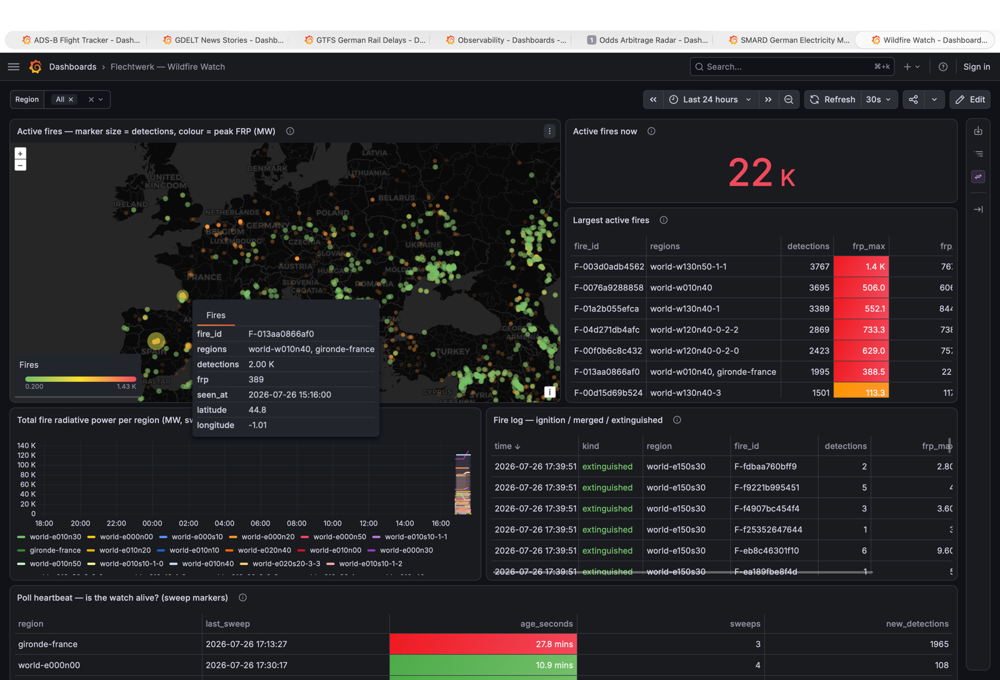
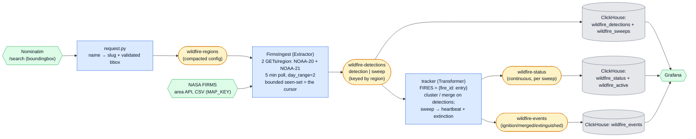

# Wildfire Watch — NASA FIRMS Active-Fire Detections

NASA's polar-orbiting satellites spot wildfires from space and publish them within minutes to
hours of acquisition. This example polls that feed for the regions you care about, clusters the
raw 375 m hotspot pixels into **persistent fire objects** held in keyed state — each with a
lifecycle of *ignition → growth → merge → extinction* — and lands detections, per-fire status
snapshots, and sparse lifecycle events in ClickHouse for a live fire map. The non-nerd pitch:
*watch NASA's satellites find wildfires from orbit, on your own map.*

It is the repo's answer to a question the others don't ask: *how do you turn a stream of
unlabelled points into named, long-lived entities that are born, grow, merge, and die — when the
source gives you no ids, no cursor, and no clock?*

<p align="center">
  
</p>
<p align="center"><em>Live in Grafana, running the <a href="#the-world-watch">world watch</a> during the 2026 fire season: ~22 000 active fires tracked planet-wide, the largest named by their <code>world-*</code> tiles, and — in the tooltip — a ~2 000-detection fire in the Landes forest south of Bordeaux carrying two region labels (<code>world-w010n40, gironde-france</code>) collapsed into one row by the dashboard's <code>fire_id</code> de-duplication. The heartbeat panel is doing exactly its job: the named region's poller had just been stopped (red, 28 min), while the world tiles sweep on.</em></p>



## What it demonstrates

Primitives the other examples don't:

1. **Spatiotemporal sessionization.** The tracker clusters point detections into persistent
   *fire objects* in keyed state. A detection within `LINK_KM` (2 km) of an existing fire's
   footprint joins it; an unmatched detection founds a new fire (an **ignition**); a detection
   that bridges two fires **merges** them (they were one blaze the satellites had caught as two
   groups); a fire unseen for `EXTINGUISH_AFTER` (12 h) of **event time** is declared
   **extinguished** and leaves the state — and when the last fire in a region goes, the region's
   whole bucket is tombstoned. GDELT clusters text into stories by similarity; this is the
   session-window shape — entities *born, grown, and killed by timeout* — with geography as the
   metric. All of it lives in a framework-free [`tracking.py`](tracking.py), so the logic tier
   drives every branch including extinction.
2. **The third point on the cursor spectrum.** ADS-B and Odds teach *snapshot source → no state
   at all*; GDELT and SMARD teach *monotonic feed → resume cursor*. FIRMS is neither. The area
   API returns a **rolling day-window snapshot** into which late detections keep arriving (NRT
   delivery runs up to ~3 h behind acquisition, so re-polling the same window keeps yielding
   genuinely new rows for old times), and it ships **no unique row id and nothing monotonic to
   resume from**. So the honest cursor is a **bounded, event-time-pruned seen-set**: derived
   identity hashes bucketed by acquisition date, whole buckets dropped as the window rolls, and
   hard-capped against the ~1 MB changelog-record ceiling — the GDELT lesson, promoted here to a
   first-class teaching point.
3. **Markers as the transformer's only clock, extended.** The framework has no timers, so
   periodic transformer logic has to ride on input records. The poller therefore emits one
   `sweep` marker per region per poll — **even when it found nothing new** — and the tracker
   hangs its *entire* lifecycle off it: status heartbeats *and* extinction timeouts. SMARD's
   settle marker finalizes one interval; this one paces an ongoing lifecycle. The trade is
   explicit: **no input means no time means no extinction.** If ingest stops, fires freeze as
   they were rather than silently ageing out — the safer failure, but it does mean a stalled
   poller looks like a still-burning landscape, which is why the sweep's `new_detections = 0` and
   the dashboard's heartbeat panel exist.
4. **The first bring-your-own-key example** — see below. The credential flows through the **ops
   caller**, so the stage stays env-free.

Secondary points worth seeing: **multi-source polling per config record** (two satellites merged
into one poll transaction, deduped against one seen-set); event-time out-of-orderness that is
*real* rather than simulated (two birds, pass-batched arrivals, ≤3 h NRT lag), handled by
`min`/`max` folds instead of buffering; and **determinism** — fire ids derive from their founding
detection and merge survivors are chosen by earliest `first_seen` with a lexicographic tie-break,
so replaying the same stream rebuilds identical state.

## The data

[NASA FIRMS](https://firms.modaps.eosdis.nasa.gov/) distributes active-fire detections from
several satellite instruments. This example uses the two **NOAA VIIRS** birds at 375 m
resolution, through one endpoint that does everything:

```bash
# west,south,east,north / day_range (1..5); today's UTC day counts as day 1
curl 'https://firms.modaps.eosdis.nasa.gov/api/area/csv/[MAP_KEY]/VIIRS_NOAA20_NRT/-9.5,36.0,-6.0,42.0/2'
curl 'https://firms.modaps.eosdis.nasa.gov/api/data_availability/csv/[MAP_KEY]/ALL'
```

The response is **CSV only**, 14 columns:

```
latitude,longitude,bright_ti4,scan,track,acq_date,acq_time,satellite,instrument,confidence,version,bright_ti5,frp,daynight
38.92123,-9.00895,319.19,0.39,0.36,2026-07-24,230,N20,VIIRS,n,2.0NRT,295.82,2.22,N
```

Things that matter when parsing it:

- **`acq_time` is an unpadded integer HHMM** — `230` is 02:30, `48` would be 00:48. Event time is
  `acq_date` + `acq_time`, always UTC.
- **There is no unique detection id.** Identity is derived: a 12-hex hash of the **raw CSV
  strings** `latitude,longitude,acq_date,acq_time,satellite` — raw text, never reparsed floats, so
  it can't drift with float formatting. This is what makes the seen-set trustworthy.
- **`confidence` is a letter for VIIRS** (`l`/`n`/`h`) but 0–100 for MODIS, so it is stored as a
  string and never decoded.
- **`bright_ti4` saturates at 367 K** and arrives as a bare integer, which is why every number is
  wrapped in `float()` (the `FLOAT` codec rejects `int`).
- **`frp`** (fire radiative power, MW) was populated on every one of the ~3 600 rows surveyed for
  this example, and a genuine `0.0` does occur — so absence is decided by an empty field, never by
  falsiness, and NULL stays distinct from 0.0 all the way into ClickHouse.
- **Latency tiers.** NRT ≤ 3 h globally, RT ≤ 60 min for much of the world, URT < 60 s for the
  US/Canada. All of them flow into the same `*_NRT` collections as they arrive — which is exactly
  why re-polling the same day window keeps producing new rows for old times.
- **Suomi NPP (`VIIRS_SNPP_NRT`) is deliberately excluded** because of the data anomaly NASA has
  flagged since 2026-03-09, even though it currently serves data. `MODIS_NRT` and `LANDSAT_NRT`
  exist too, with different column semantics; the `_SP` variants are the standard-processing
  archive (backfill material, out of scope).
- The **country API is currently unavailable**, so a bounding box is the only way to scope a
  request — which suits us, since a config record carries one.

## Getting a MAP_KEY (and why this example isn't keyless)

The ingest stage needs a free NASA MAP_KEY, requested with an email address at
<https://firms.modaps.eosdis.nasa.gov/api/map_key/> and issued instantly:

```bash
export FIRMS_MAP_KEY=<your key>
curl 'https://firms.modaps.eosdis.nasa.gov/mapserver/mapkey_status/?MAP_KEY='"$FIRMS_MAP_KEY"
# { "transaction_limit" : 5000, "current_transactions": 0, "transaction_interval" : "10 minutes" }
```

Every other example in this repo runs on keyless public data, and that streak is worth breaking
only knowingly. Here is the reasoning:

- **NASA's terms require it.** The quota (5000 transactions per 10-minute interval) is per key,
  and the data carries an attribution requirement. An anonymous shared endpoint isn't on offer.
- **A demo repo should show this once.** Real pipelines have credentials. Doing it properly —
  the *ops caller* reads the environment and injects the key as a constructor argument, while the
  stage never touches `os.environ` — demonstrates that the framework's no-env-magic rule and
  real-world secrets are compatible. Getting that wrong (an env read buried in a stage) is a
  common enough mistake to be worth one worked counter-example.
- **The cost is bounded — but you have to count it.** Two GETs per region per poll, each billed
  as *several* transactions (~4 for a 10° box over two days), at the 15-minute poll interval:
  20 named regions cost ~160 transactions per round, nowhere near the meter. A few hundred
  regions is a different animal — see "Count your quota" under the world watch, which is what
  sets that interval. Watch the `mapkey_status` endpoint above rather than trusting the
  arithmetic, and note that this is also why `request-wildfire` warns about boxes wider than 10°
  on a side.
- **A 400 doesn't tell you which fault it is.** FIRMS answers a wrong key *and* an exhausted
  quota with the same `400 Invalid MAP_KEY.` — `mapkey_status` conflates them too ("MAP_KEY is
  invalid or your have exceeded your transaction/time limit"). The ingest stage's error message
  therefore names both causes and hands you the status URL; if the key checks out there, you are
  over quota and it drains within 10 minutes of the polling stopping.

`FIRMS_MAP_KEY` is only needed by `run-wildfire-ingest`. `setup-wildfire` and `run-wildfire-tracker` work
without it, and `request-wildfire` merely *uses* it, if present, to preview a region's live detection
count.

## Run it

With the [stack](../../README.md#the-stack) up:

```bash
export FIRMS_MAP_KEY=<your key>
uv run poe wildfire                     # setup (topics + schema) then run both stages
uv run poe request-wildfire "Alentejo, Portugal"
```

or step by step:

```bash
uv run poe setup-wildfire                # topics + ClickHouse schema (nothing seeded)
uv run poe request-wildfire "Attica, Greece"          # geocoded, validated, previewed
uv run poe request-wildfire "My Valley" -8.9 36.9 -6.8 39.2   # or pin the bbox yourself
uv run poe request-wildfire world        # or watch the whole planet (see "The world watch")
uv run poe run-wildfire-ingest           # poll both VIIRS birds -> wildfire-detections
uv run poe run-wildfire-tracker          # cluster detections    -> wildfire-status / wildfire-events
```

With **zero regions** both stages idle politely — nothing is seeded, because where to look is a
human's choice and a default would spend NASA's quota on a place you don't care about. Pick
somewhere that is actually burning (browse the [FIRMS
map](https://firms.modaps.eosdis.nasa.gov/map/); in late July the Mediterranean rarely
disappoints).

`request-wildfire` geocodes the name **at request time and caches all four box edges in the config
record**, so the record fully describes the region it asks for. It prints the resolved box **and
what the name actually matched** (Nominatim's `display_name` + `addresstype`) before writing
anything, because geocoding a place name is genuinely ambiguous — Nominatim returns one best
guess, a name backed by an OSM *node* rather than a boundary relation yields a synthetic ±1° box,
and two traps found the hard way are worth naming: the typo `"Bordeux, France"` silently matches
*Rue Robert Bordeux*, a street in Picardy (`— road` in the match line is the tell), and a country
name resolves to its whole OSM relation — "France" spans Kerguelen to French Polynesia, because
the Republic does. A box wider than 10° on a side gets a warning; wider than **60° is refused**,
because a single region that size cannot survive the per-key state records (each is one ~1 MB
changelog record — see the world watch below for the right way to ask for "everything"). It also
reads the compacted config topic and **warns when the new box overlaps a region you already
watch**, naming the intersection:

```
Already watching 1 region(s):
  alentejo-portugal        west=-8.9606 south=36.9551 east=-6.7606 north=39.1551

  ⚠️  Overlaps 'alentejo-portugal': west=-7.6417 south=37.8410 east=-6.7606 north=39.1551 (0.88° × 1.31°).
      A fire in there is tracked TWICE — one fire object per region …
```

That check is the reason the box is cached rather than resolved later: you cannot intersect
geometry you don't have yet. Two consequences worth knowing. `ingest.enrich_config` becomes a
**fallback** — it still geocodes a record that arrives without a box, which keeps a hand-produced
`{"region": …, "name": …}` (from Kafbat) a first-class way to ask for a region. And a cached box is
a **snapshot of a lookup**: change `PAD_DEG`, or wait for OSM boundaries to move, and existing
regions keep the box they were created with — re-run the command to refresh one.

With a key set it also prints the current detection count per satellite, the fastest way to tell a
good watch region from a typo. Retire one with `uv run poe request-wildfire retire <slug>` (a
compacted-topic tombstone).

**What appears when.** Within one poll (~5 min) detections and a sweep land on
`wildfire-detections`, and the tracker turns them into `ignition` events immediately. Status
heartbeats appear on the *next* sweep after that — status is deliberately sweep-paced, not
detection-paced. Rows show up in ClickHouse via the Kafka-engine views (`SELECT count() FROM
flechtwerk.wildfire_detections`, `SELECT * FROM flechtwerk.wildfire_active FINAL`), and the **Wildfire
Watch** dashboard plots the map, the FRP timeline, and the fire log. Browse the topics in [Kafbat
UI](http://localhost:8080); a hand-produced `wildfire-regions` record works too.

**Scaling out is free — with two caveats worth knowing.** A second ingest instance sharing the
`wildfire-ingest` application id splits the config topic's 8 **extractor tokens** with the first
(verified live: `Acquired tokens [0, 1, 2, 3]` and `[4, 5, 6, 7]`), and killing one hands its
tokens back to the survivor. But the `run-wildfire-ingest` target hardcodes metrics port 9120 and
`client_id`, so running it twice *on one host* dies with `Address already in use` — a second local
instance needs its own port and client id (build it in a few lines with `examples._runner.run`,
or pass `metrics_port=0`). And because ownership is by config-topic *partition*, a couple of
regions can easily hash into one instance's token range and leave the other idle; the split shows
up once you have more regions than that. The framework's built-in `{"suspended": true}` config
switch works here too — set it on a region to park it without retiring it.

## The world watch

```bash
uv run poe request-wildfire world          # tile the planet, write every tile as a region
uv run poe request-wildfire retire world   # tombstone all of them
```

Watching the entire planet with **one** region cannot work, and the reason is the pair of
records this example is built around: a region's dedupe seen-set and its fire bucket are each
**one changelog record** with a hard ~1 MB ceiling (the Kafka client's `max_request_size`).
The planet currently produces ~215 k VIIRS detections a day across the two birds — a world
seen-set would be ~6 MB, and the worst single 10° cell on Earth (the Angola–Zambia savanna
belt, measured 2026-07-26) clusters 27 k detections/day into a 1.9 MB fire bucket all by
itself. The first attempt at "France" — whose Nominatim box happens to span the whole Republic,
Kerguelen to Polynesia — crashlooped both stages exactly this way, which is why `request-wildfire`
now refuses boxes wider than 60°. Since `flechtwerk` 0.7.6 the approach to that ceiling no longer
has to be derived from the caps' arithmetic: the shared **Observability** dashboard's *Record
Sizes* row charts `flechtwerk_state_record_max_bytes` against the 1 MiB line, so a tile growing
toward it is visible on a panel while it is still healthy.

The architecture's own answer is the right one: **the world is just many ordinary regions.**
`world` tiles the planet into a few hundred normal config records (slugs `world-*`), and the
stages never learn the word "world" — state, clustering cost, and fire identity all shard per
tile, and a second `run-wildfire-ingest` instance splits the planet by config partition for
free. Three design points:

- **The grid is adaptive.** A 10° base grid covers all land (267 cells, Natural Earth 110 m,
  nothing south of 60°S — Antarctica doesn't burn); any cell that the **live public 24 h
  snapshot** (the keyless `J1/J2_VIIRS_C2_Global_24h.csv` files — tiling spends none of your
  quota) shows above ~6 k detections splits quadtree-style down to 1.25°, every quadrant kept
  because a fire can ignite where there was nothing. Offshore cells with detections (gas
  flares) join the base set automatically. Today that lands at ~340 tiles, most of them the
  quiet 10° kind.
- **The tiling is a snapshot of a lookup**, exactly like a geocoded box cached in a config
  record. The burn belt moves with the seasons; re-run `request-wildfire world` to re-tile —
  it writes the new set and tombstones tiles that fell out of it. A stale tiling degrades
  politely, never fatally: an over-hot tile trims its seen-set (bounded re-emission, warned)
  and force-extinguishes its stalest fires past `MAX_FIRES` (id churn that self-heals like any
  false extinction, warned) — both caps exist precisely so the worst day on Earth costs
  accuracy in one tile rather than a crashloop.
- **Count your quota — it sets the poll interval.** ~350 tiles × 2 satellites ≈ 700 requests per
  round, and FIRMS bills an area request as *several* transactions — **measured 2026-07-26: ~4 per
  request for this tiling, ≈ 2 800 transactions per round** against the default
  5 000-per-10-minutes budget. The framework polls every active config *concurrently* in one
  cycle, so a round's spend lands as a burst; what matters is therefore **how many rounds fall
  inside one 10-minute window**, and at the 5-minute interval this example originally shipped, the
  answer is two — ~5 600 transactions, over the line. That is not a theoretical worry:
  **2026-07-27 the world watch exhausted the key**, after which FIRMS 400s every request, the
  cycle dies, the supervisor restarts it, and the fresh round re-spends the next window
  immediately — an exhausted quota that can never drain. Hence `POLL_INTERVAL = 15 minutes`
  (one round per window, with a full round of headroom for exactly that restart), and hence the
  stage now **latches the first 400 and stops sending** so a doomed round costs one request
  instead of 700. Check
  `https://firms.modaps.eosdis.nasa.gov/mapserver/mapkey_status/?MAP_KEY=<your key>` after your
  first round rather than trusting these numbers to hold; NASA will raise the limit on request,
  which is the real fix if you want the world watch polled faster. And note the scale-out story
  changes at world size: a **second ingest instance on the same key doubles the transaction rate
  and trips the quota** — the bottleneck is NASA's meter, not your CPU, so scaling out needs a
  second key (one per instance) rather than a second process. The status stream also gets loud at
  world scale — one snapshot per active fire per sweep is tens of thousands of rows per round
  during the fire season (the first live round tracked ~19 000 active fires worldwide).

A fire straddling a tile border is tracked once per tile (the overlap caveat below, in
edge-touching form) — the honest cost of region-partitioned discovery, unchanged.

**Run the world watch supervised.** The stages keep the framework's let-it-crash rule — no
in-process retry — and at ~700 GETs per round, one FIRMS response hanging past the 60 s HTTP
timeout is a matter of *when*, not if (the first live world round died exactly this way, at
GET ~560, leaving rectangular holes over the Zambian savanna where the round's tail never got
its first poll — a quiet tile without even a sweep is the tell). `uv run poe wildfire` already
wraps both stages in a restart-on-10s loop; a bare `run-wildfire-ingest` is for a terminal
where you *watch* it. A restart is cheap on Kafka (the seen-set restores, so re-polls re-emit
nothing) but re-spends the round's transactions, so back-to-back restarts can brush the quota
until a 10-minute window resets. That drains by itself *because* a rejected key now stops the
round at its first 400 — with the whole round still firing, the restart loop was the thing
keeping the key exhausted, which is how 2026-07-27's incident went.

## Caveats (read these)

- **A detection is a 375 m pixel that contained fire — not "a fire", and not a fire's boundary.**
  `scan`/`track` report how coarse each pixel is (they grow toward the swath edge). A cluster's
  `detections` count measures *pixel sightings*, so the same fire seen by both satellites on two
  passes counts twice; treat it as a size proxy, not an area.
- **Clouds and smoke hide fires.** A gap in detections means the satellites didn't see it, which
  is not the same as "it stopped burning".
- **NRT latency is up to ~3 h**, and satellite revisit gaps at mid-latitudes are typically 4–6 h
  (worst ~8 h). Nothing here is real-time.
- **False extinctions happen, and they self-heal.** An unlucky revisit gap plus NRT lag can age
  out a fire that is still burning; the next detection then founds a *new* fire with a new id.
  The event log shows it plainly (an `extinguished` followed by an `ignition` in the same place).
  This is preferred over a timeout long enough to never be wrong, which would leave dead fires on
  the map for days.
- **A bucket past `MAX_FIRES` (2 000) force-extinguishes its stalest fires.** The whole
  per-region fire dict is one changelog record, so it carries a hard cap the same way the
  seen-set does. In a sanely sized region it never binds — a violent Iberian fire day runs
  tens of fires — but the hottest world tiles can hit it, and the degradation is the same
  self-healing one as a false extinction: the evicted fire's next detection re-founds it
  under a new id, with a WARNING in the tracker log.
- **`LINK_KM` is the one knob that changes everything.** Raise it and distinct fires fuse; lower
  it and one fire fragments into a cloud of short-lived objects. 2 km ≈ 5 VIIRS pixels is tuned to
  bridge gaps *within* one fire without merging neighbours.
- **Overlapping regions track the same fire twice — and the dashboard de-duplicates it.** A
  region is a watch *scope*, and fire identity is *discovered* by the tracker rather than known
  up front, which is precisely why the **region** is the partition key and not the fire. So a
  blaze inside two overlapping boxes occupies two independent state buckets, produces two
  detection streams, and gets two status rows. That is the honest cost of region-partitioned
  discovery, and it is not something the pipeline can fix without a second, globally-keyed
  reconciliation stage (out of scope here).

  What saves the presentation layer is **determinism**: a `fire_id` is derived from its founding
  detection, so both regions — polling the same FIRMS rows for the shared area, in the same
  sorted order — name the fire *identically*. The dashboard therefore groups by `fire_id`:
  "Active fires now" uses `uniqExact(fire_id)`, and the map and the largest-fires table collapse
  duplicates into one row whose `regions` column names every region that sees it. Verified live
  with two overlapping Iberian regions: 7 status rows, 5 distinct fires.

  Two caveats on that trick. A `fire_id` is unique **per region, not globally** — ClickHouse keys
  `(region, fire_id)` — and the collision is what the dedupe exploits, so don't "fix" it. And it
  is a heuristic: if one box clips a fire so that its *earliest* pixel falls outside, that region
  founds the fire from a different detection and gets a different id, which the grouping won't
  merge. Prefer non-overlapping watch boxes if exact counts matter — `request-wildfire` warns you
  at the moment you would create an overlap, with the intersection spelled out.
- **Not for safety-of-life decisions.** This is a stream-processing demo over a science feed. For
  anything that matters, follow your official emergency services and civil-protection authority
  (in the EU, [112](https://ec.europa.eu/echo/); in the US,
  [InciWeb](https://inciweb.wildfire.gov/) and local warnings).

## Attribution

We acknowledge the use of data from NASA's Fire Information for Resource Management System
(FIRMS) (<https://earthdata.nasa.gov/firms>), part of NASA's Earth Science Data and Information
System (ESDIS).

Region geocoding uses [Nominatim](https://nominatim.org/) — data ©
[OpenStreetMap](https://www.openstreetmap.org/copyright) contributors, ODbL 1.0.

## Extension points (deliberately not shipped)

- **EONET enrichment** — joining fire clusters to NASA EONET's *named* events
  ("Alexandroupolis Fire") via a second config-driven poller. The natural follow-up, and keyless.
- **Phone alerts** — piping `wildfire-events` through the fermentation example's MQTT-bridge pattern
  to ntfy or Pushover. The event stream is alert-shaped on purpose.
- **Historical backfill** — the `_SP` standard-processing sources plus the endpoint's date
  parameter would replay past fire seasons through the same pipeline. A lovely EOS-replay demo,
  but it belongs to a dedicated reprocessing example.
- **URT for the US/Canada** (<60 s latency) — same API, different tier.
- **MODIS / Landsat sources** — more sensors, same shape; adds column-mapping noise without a new
  framework lesson.
- **Reverse-geocoding fires to admin regions** via ClickHouse polygon dictionaries — the ADS-B
  example already teaches that, and reusing its dictionaries would couple the two.
- **Encrypted MAP_KEY in the config record** — the framework ships a keyring/secrets facility
  (`flechtwerk.secrets`, `keyring=` on `Flechtwerk.of`) that could carry the key as an encrypted
  config attribute instead of an environment variable. No example uses it yet, and it deserves
  its own.
- **Dynamic re-tiling of the world watch** — an ops cron re-running `request-wildfire world`
  as the burn belt moves, rather than the operator doing it. The mechanism (re-tile, diff,
  tombstone) already exists; only the scheduling is missing, and it belongs to ops, not to a
  stage.
